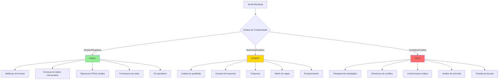
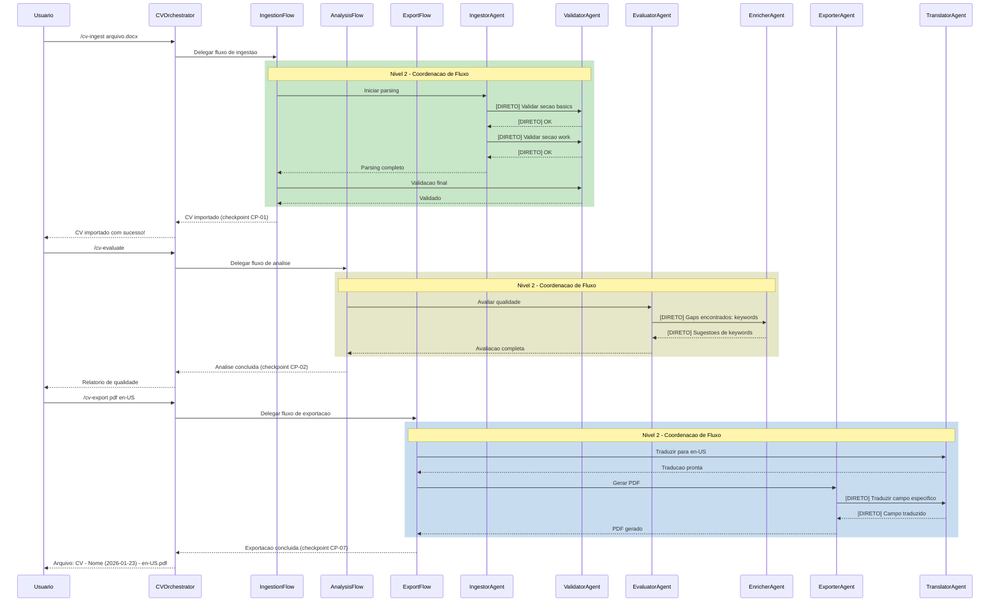
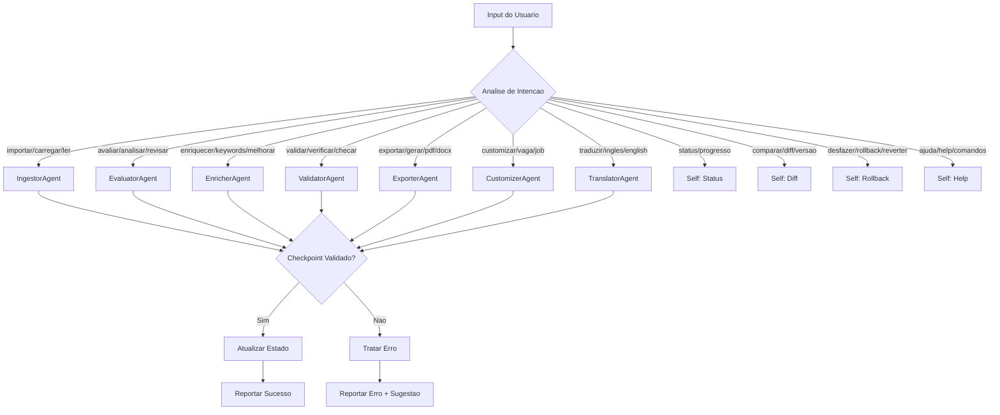
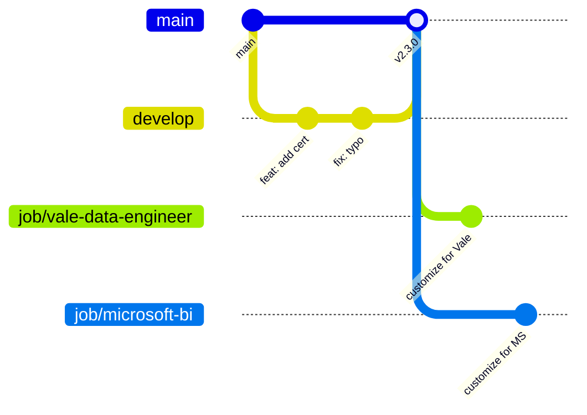
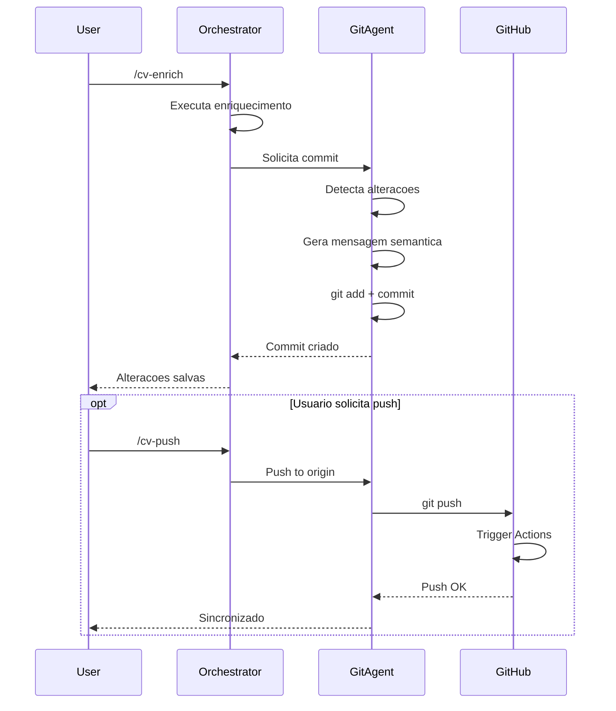
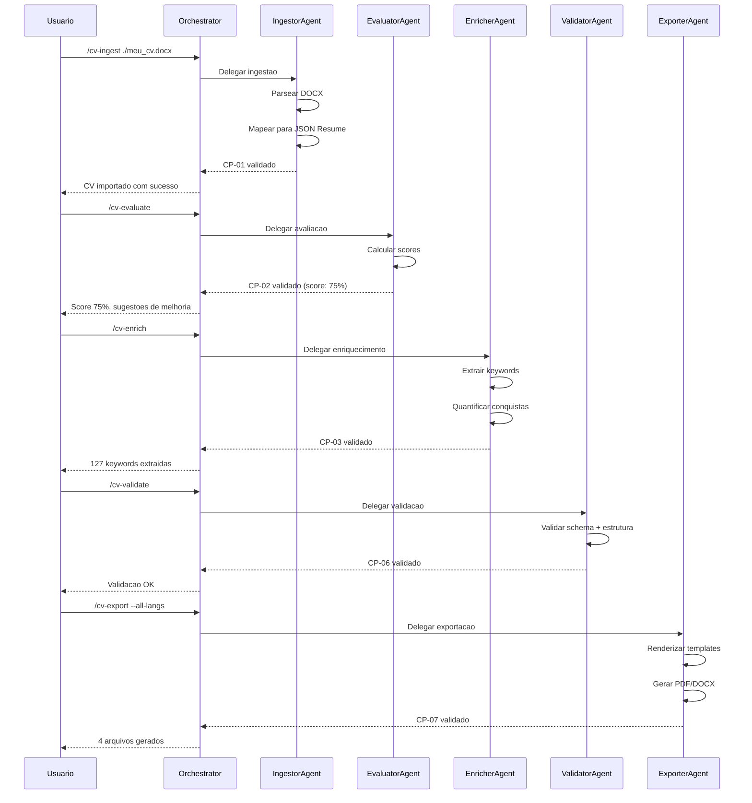
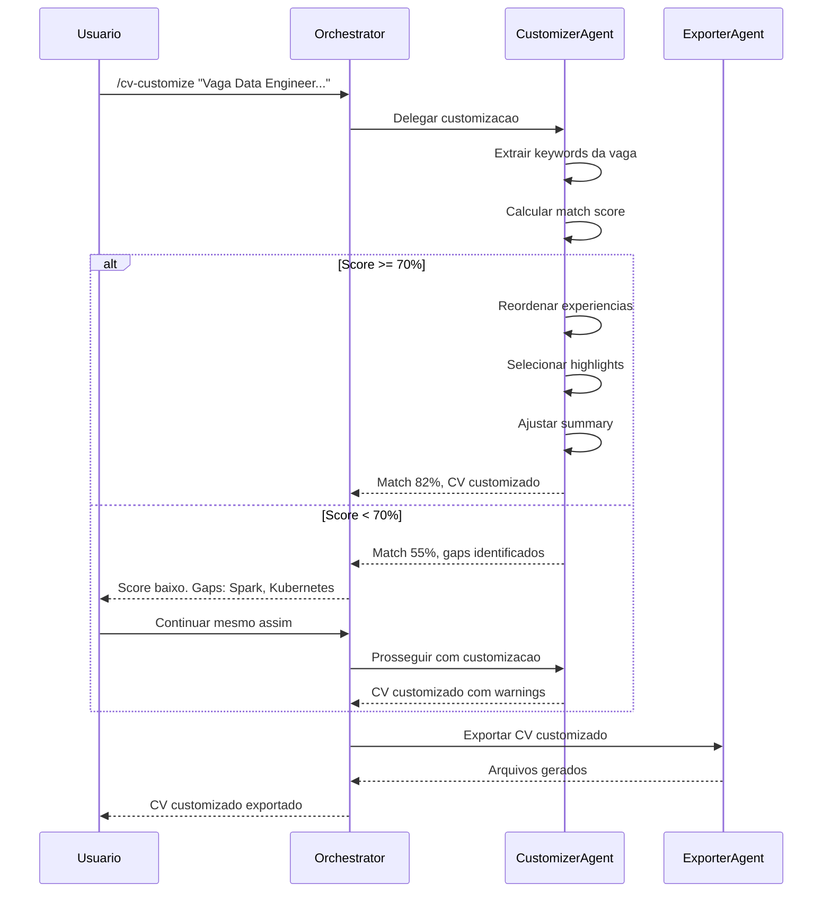
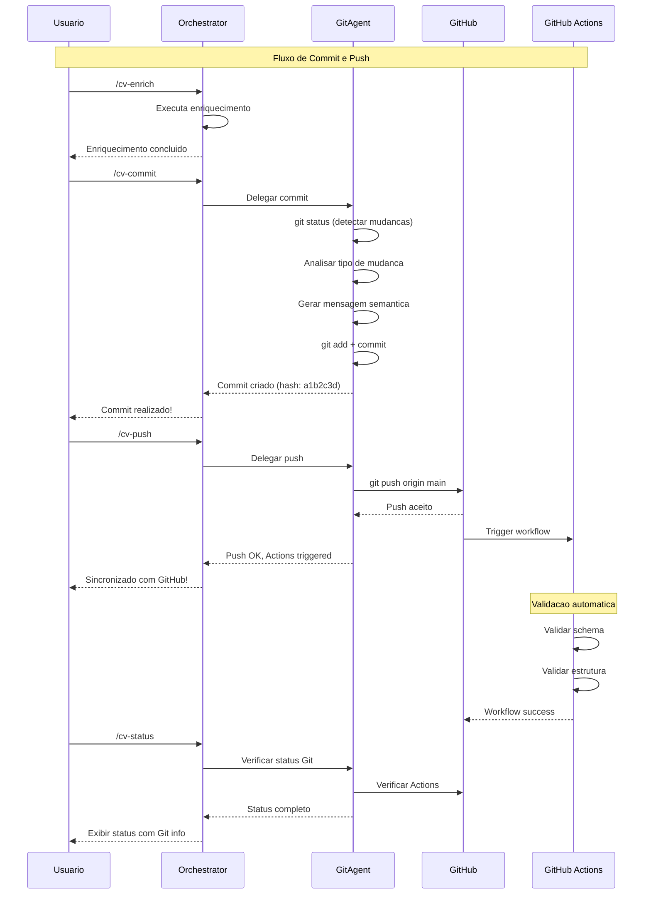
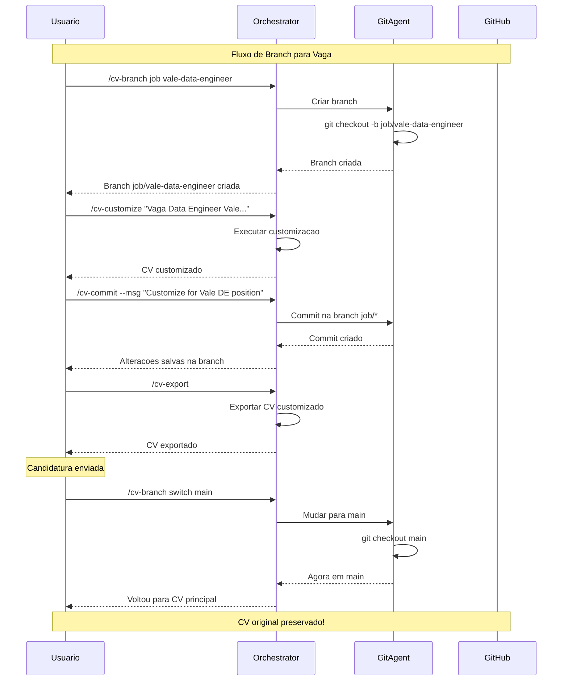
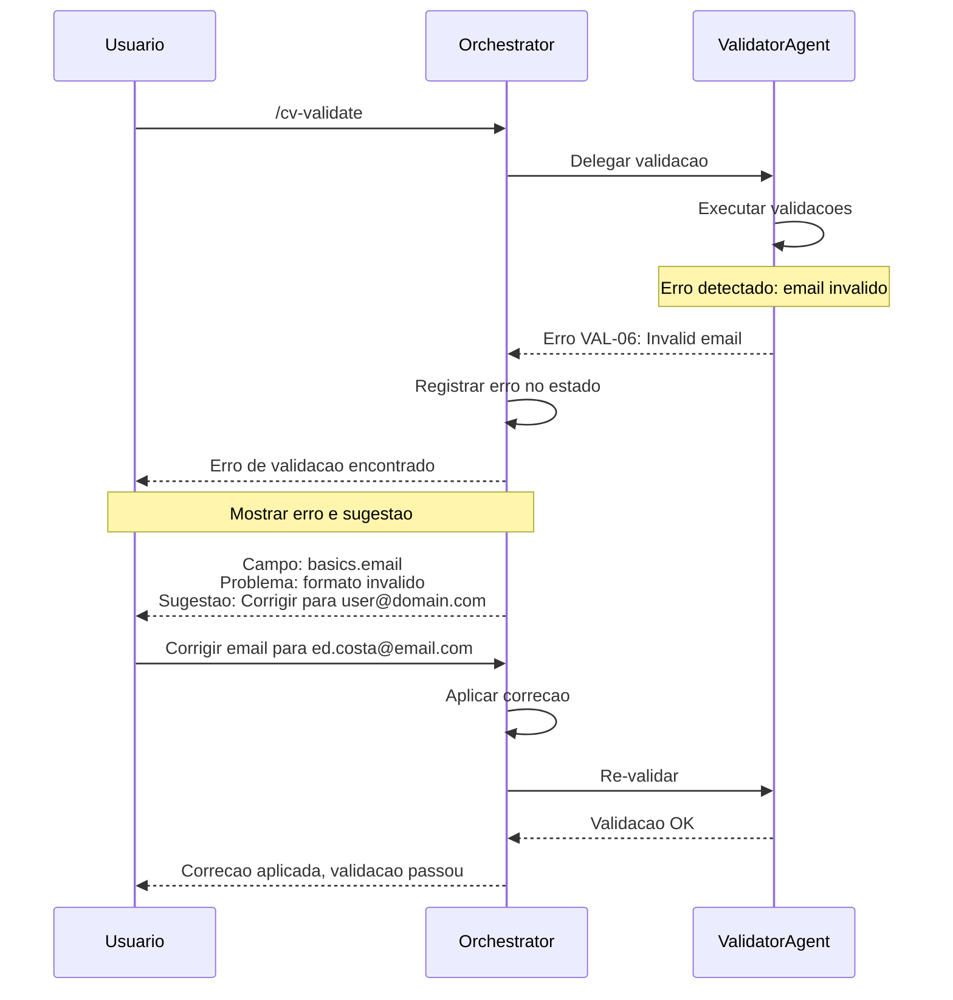

# Claude Code Plugin - CV Generator

Arquitetura completa para implementacao de um plugin Claude Code com agente orquestrador, subagentes especializados, skills e comandos para automacao do processo de geracao de curriculo.

---

## Indice

1. [Visao Geral da Arquitetura](#1-visao-geral-da-arquitetura)
2. [Estrategia de Modelos e Otimizacao de Custos](#2-estrategia-de-modelos-e-otimizacao-de-custos)
3. [Arquitetura Hierarquica de Orquestracao](#3-arquitetura-hierarquica-de-orquestracao)
4. [Agente Orquestrador Principal](#4-agente-orquestrador-principal)
5. [Subagentes Especializados](#5-subagentes-especializados)
6. [Skills e Comandos](#6-skills-e-comandos)
7. [Componentes Auxiliares](#7-componentes-auxiliares)
8. [Fluxos de Interacao](#8-fluxos-de-interacao)
9. [Configuracao e Instalacao](#9-configuracao-e-instalacao)
10. [Melhorias Propostas](#10-melhorias-propostas)

---

## 1. Visao Geral da Arquitetura

### 1.1 Diagrama de Arquitetura Hierarquica

```mermaid
flowchart TB
    subgraph USER ["Usuario"]
        U[Chat Interface]
    end

    subgraph LEVEL1 ["Nivel 1 - Orquestrador Principal"]
        O[CVOrchestratorAgent]
        O --> SM[State Manager]
        O --> DM[Decision Matrix]
        O --> QM[Quality Monitor]
    end

    subgraph LEVEL2 ["Nivel 2 - Sub-Orquestradores de Fluxo"]
        FO1[IngestionFlowOrchestrator]
        FO2[AnalysisFlowOrchestrator]
        FO3[ExportFlowOrchestrator]
        FO4[GitFlowOrchestrator]
        FO5[EditFlowOrchestrator]
    end

    subgraph LEVEL3 ["Nivel 3 - Subagentes Executores"]
        SA1[IngestorAgent]
        SA2[EvaluatorAgent]
        SA3[EnricherAgent]
        SA4[ValidatorAgent]
        SA5[ExporterAgent]
        SA6[CustomizerAgent]
        SA7[TranslatorAgent]
        SA8[GitAgent]
        SA9[EditorAgent]
    end

    subgraph SKILLS ["Skills"]
        SK1[/cv-ingest]
        SK2[/cv-evaluate]
        SK3[/cv-enrich]
        SK4[/cv-validate]
        SK5[/cv-export]
        SK6[/cv-customize]
        SK7[/cv-translate]
        SK8[/cv-status]
        SK9[/cv-diff]
        SK10[/cv-rollback]
        SK11[/cv-commit]
        SK12[/cv-push]
        SK13[/cv-sync]
        SK14[/cv-branch]
        SK15[/cv-add]
        SK16[/cv-edit]
        SK17[/cv-remove]
        SK18[/cv-reorder]
        SK19[/cv-list]
    end

    subgraph TOOLS ["Ferramentas MCP"]
        T1[FileParser]
        T2[SchemaValidator]
        T3[KeywordExtractor]
        T4[PDFGenerator]
        T5[DOCXGenerator]
        T6[JobMatcher]
        T7[TranslationEngine]
        T8[GitOperations]
    end

    subgraph STORAGE ["Armazenamento"]
        DB1[(cv_data.json)]
        DB2[(schema.json)]
        DB3[(templates/)]
        DB4[(output/)]
        DB5[(history/)]
    end

    subgraph GIT ["Git/GitHub"]
        G1[(Local Repo)]
        G2[(Remote Origin)]
        G3[GitHub Actions]
    end

    %% Nivel 1 -> Nivel 2
    U <--> O
    O --> FO1 & FO2 & FO3 & FO4 & FO5
    O <--> SK8 & SK9 & SK10

    %% Nivel 2 -> Nivel 3
    FO1 --> SA1 & SA4
    FO2 --> SA2 & SA3 & SA6
    FO3 --> SA5 & SA7
    FO4 --> SA8
    FO5 --> SA9 & SA4 & SA7

    %% Comunicacao Direta entre Agentes (linha tracejada)
    SA1 <-.->|validacao inline| SA4
    SA7 <-.->|traducao on-demand| SA5
    SA2 <-.->|gaps para enriquecer| SA3
    SA9 <-.->|validacao campos| SA4
    SA9 <-.->|auto-traducao| SA7

    %% Skills
    SA1 <--> SK1
    SA2 <--> SK2
    SA3 <--> SK3
    SA4 <--> SK4
    SA5 <--> SK5
    SA6 <--> SK6
    SA7 <--> SK7
    SA9 <--> SK15 & SK16 & SK17 & SK18 & SK19
    SA8 <--> SK11 & SK12 & SK13 & SK14

    %% Tools
    SA1 --> T1
    SA4 --> T2
    SA3 --> T3
    SA5 --> T4 & T5
    SA6 --> T6
    SA7 --> T7
    SA8 --> T8

    %% Storage
    T1 & T2 & T3 --> DB1 & DB2
    T4 & T5 --> DB3 & DB4
    O --> DB5
    T8 --> G1
    G1 <--> G2
    G2 --> G3
    G3 -.-> DB1
```

### 1.2 Principios de Design

| Principio | Descricao | Beneficio |
|-----------|-----------|-----------|
| **Single Responsibility** | Cada subagente tem uma unica responsabilidade | Manutencao simplificada |
| **Fail-Fast** | Validacao em cada etapa antes de prosseguir | Deteccao precoce de erros |
| **Idempotency** | Operacoes podem ser repetidas sem efeitos colaterais | Recuperacao de falhas |
| **Observability** | Logging e metricas em todos os componentes | Debugging facilitado |
| **Extensibility** | Novos subagentes podem ser adicionados facilmente | Evolucao do sistema |

### 1.3 Estrutura de Diretorios do Plugin

```
.claude/
├── settings.local.json          # Configuracoes locais
├── agents/
│   ├── orchestrator.md          # Definicao do orquestrador
│   ├── ingestor.md              # Subagente de ingestao
│   ├── evaluator.md             # Subagente de avaliacao
│   ├── enricher.md              # Subagente de enriquecimento
│   ├── validator.md             # Subagente de validacao
│   ├── exporter.md              # Subagente de exportacao
│   ├── customizer.md            # Subagente de customizacao
│   ├── translator.md            # Subagente de traducao
│   └── git.md                   # Subagente de versionamento Git
├── skills/
│   ├── cv-ingest.md             # Skill de ingestao
│   ├── cv-evaluate.md           # Skill de avaliacao
│   ├── cv-enrich.md             # Skill de enriquecimento
│   ├── cv-validate.md           # Skill de validacao
│   ├── cv-export.md             # Skill de exportacao
│   ├── cv-customize.md          # Skill de customizacao
│   ├── cv-translate.md          # Skill de traducao
│   ├── cv-commit.md             # Skill de commit Git
│   ├── cv-push.md               # Skill de push Git
│   ├── cv-sync.md               # Skill de sincronizacao Git
│   ├── cv-branch.md             # Skill de gerenciamento de branches
│   ├── cv-status.md             # Skill de status
│   ├── cv-diff.md               # Skill de comparacao
│   └── cv-rollback.md           # Skill de rollback
├── hooks/
│   ├── pre-commit.sh            # Validacao antes de commit
│   ├── post-export.sh           # Acoes pos-exportacao
│   └── on-error.sh              # Tratamento de erros
├── templates/
│   └── prompts/
│       ├── ingest_prompt.md
│       ├── evaluate_prompt.md
│       └── ...
└── mcp/
    └── cv-tools-server/
        ├── package.json
        ├── src/
        │   ├── index.ts
        │   ├── tools/
        │   │   ├── file-parser.ts
        │   │   ├── schema-validator.ts
        │   │   ├── keyword-extractor.ts
        │   │   ├── pdf-generator.ts
        │   │   ├── docx-generator.ts
        │   │   ├── job-matcher.ts
        │   │   ├── translation-engine.ts
        │   │   └── git-operations.ts
        │   └── types/
        │       └── cv-types.ts
        └── tsconfig.json
```

---

## 2. Estrategia de Modelos e Otimizacao de Custos

Esta secao define a estrategia de selecao de modelos para otimizar custo, velocidade e qualidade.

### 2.1 Modelos Disponiveis e Caracteristicas

| Modelo | Custo Relativo | Velocidade | Reasoning | Uso Recomendado |
|--------|----------------|------------|-----------|-----------------|
| **Haiku** | $ (baixo) | Muito rapida | Basico | Tarefas repetitivas, validacoes simples, formatacao |
| **Sonnet** | $$ (medio) | Rapida | Avancado | Analises, geracoes de conteudo, decisoes |
| **Opus** | $$$ (alto) | Moderada | Expert | Planejamento complexo, resolucao de problemas |

### 2.2 Matriz de Roteamento Inteligente

O orquestrador deve usar esta matriz para decidir qual modelo delegar:



### 2.3 Catalogo de Componentes com Model Hints

#### Legenda de Icones
- 🟢 **Haiku** - Tarefas simples e rapidas (custo baixo)
- 🟡 **Sonnet** - Tarefas moderadas com analise (custo medio)
- 🔴 **Opus** - Tarefas complexas com reasoning profundo (custo alto)

---

### 2.4 Registro de Subagentes (Agent Registry)

```yaml
# .claude/agent-registry.yaml
# Registro centralizado de subagentes com metadados para roteamento inteligente

agents:

  # ============================================================
  # ORCHESTRATOR - Coordenador Central
  # ============================================================
  orchestrator:
    name: "CVOrchestratorAgent"
    description: |
      Coordenador central do sistema de CV. Recebe requisicoes do usuario,
      analisa a intencao, seleciona o subagente apropriado e gerencia o fluxo
      completo de execucao. Mantem estado da sessao e garante qualidade.

    model: "sonnet"  # Precisa de reasoning para decisoes
    fallback_model: "opus"  # Para casos complexos

    keywords:
      triggers:
        - "cv", "curriculo", "resume"
        - "ajuda", "help", "status"
        - "iniciar", "comecar", "start"
      capabilities:
        - "coordenacao", "orquestracao", "delegacao"
        - "estado", "sessao", "contexto"
        - "decisao", "roteamento", "fluxo"

    responsibilities:
      - "Interpretar intencao do usuario"
      - "Selecionar subagente apropriado"
      - "Gerenciar estado e contexto"
      - "Monitorar qualidade e checkpoints"
      - "Tratar erros e recuperacao"

    routing_rules:
      - pattern: "importar|carregar|ler arquivo"
        delegate_to: "ingestor"
        model_hint: "haiku"
      - pattern: "avaliar|analisar qualidade|revisar"
        delegate_to: "evaluator"
        model_hint: "sonnet"
      - pattern: "enriquecer|keywords|melhorar|ats"
        delegate_to: "enricher"
        model_hint: "sonnet"
      - pattern: "validar|verificar|checar schema"
        delegate_to: "validator"
        model_hint: "haiku"
      - pattern: "exportar|gerar|pdf|docx"
        delegate_to: "exporter"
        model_hint: "haiku"
      - pattern: "customizar|vaga|job|posicao"
        delegate_to: "customizer"
        model_hint: "sonnet"
      - pattern: "traduzir|ingles|english|portugues"
        delegate_to: "translator"
        model_hint: "sonnet"
      - pattern: "commit|push|pull|branch|git"
        delegate_to: "git"
        model_hint: "haiku"

  # ============================================================
  # INGESTOR - Parser de Arquivos
  # ============================================================
  ingestor:
    name: "IngestorAgent"
    model: "haiku"  # 🟢 Tarefa estruturada e repetitiva

    description: |
      Especialista em importar e parsear arquivos de curriculo em diversos
      formatos (DOCX, PDF, MD, JSON, TXT). Extrai dados estruturados e
      normaliza para o formato JSON Resume.

    keywords:
      triggers:
        - "importar", "carregar", "ler", "abrir"
        - "arquivo", "documento", "file"
        - "docx", "pdf", "markdown", "json", "txt"
        - "parser", "extrair", "converter"
      capabilities:
        - "parse", "extracao", "normalizacao"
        - "mapeamento", "conversao", "estruturacao"
      outputs:
        - "json_resume", "dados_estruturados"

    complexity: "low"
    typical_tokens: 500-2000

    tasks:
      simple:  # 🟢 Haiku
        - "Ler arquivo e extrair texto"
        - "Identificar secoes por headers"
        - "Mapear campos para schema"
        - "Normalizar datas e formatos"
      complex:  # 🟡 Escalar para Sonnet se necessario
        - "Parsear PDF com layout complexo"
        - "Inferir estrutura de texto livre"
        - "Resolver ambiguidades de secoes"

    checkpoint: "CP-01"

    example_prompts:
      - "/cv-ingest ./meu_cv.docx"
      - "Importar curriculo do arquivo resume.pdf"
      - "Carregar dados do cv_backup.json"

  # ============================================================
  # EVALUATOR - Avaliador de Qualidade
  # ============================================================
  evaluator:
    name: "EvaluatorAgent"
    model: "sonnet"  # 🟡 Requer analise e julgamento

    description: |
      Especialista em avaliar qualidade e completude de curriculos.
      Calcula scores por secao, identifica gaps e sugere melhorias
      especificas baseadas em melhores praticas de mercado.

    keywords:
      triggers:
        - "avaliar", "analisar", "revisar", "checar"
        - "qualidade", "completude", "score"
        - "gaps", "faltando", "incompleto"
        - "sugestao", "melhoria", "recomendacao"
      capabilities:
        - "avaliacao", "analise", "scoring"
        - "identificacao_gaps", "sugestoes"
        - "comparacao", "benchmark"
      outputs:
        - "score", "relatorio", "sugestoes"

    complexity: "medium"
    typical_tokens: 1000-3000

    tasks:
      simple:  # 🟢 Haiku - calculos diretos
        - "Calcular percentual de campos preenchidos"
        - "Verificar presenca de secoes obrigatorias"
        - "Contar itens por secao"
      moderate:  # 🟡 Sonnet - analise qualitativa
        - "Avaliar qualidade das descricoes"
        - "Identificar highlights sem metricas"
        - "Sugerir melhorias especificas"
      complex:  # 🔴 Opus - analise profunda
        - "Comparar com benchmarks de mercado"
        - "Analisar progressao de carreira"
        - "Identificar inconsistencias sutis"

    checkpoint: "CP-02"

    scoring_weights:
      basics: 0.25
      work: 0.30
      education: 0.15
      skills: 0.15
      extras: 0.15

  # ============================================================
  # ENRICHER - Enriquecedor de Dados
  # ============================================================
  enricher:
    name: "EnricherAgent"
    model: "sonnet"  # 🟡 Requer analise semantica

    description: |
      Especialista em enriquecer curriculos com keywords ATS, quantificar
      conquistas, categorizar experiencias e gerar dados otimizados para
      sistemas de rastreamento de candidatos.

    keywords:
      triggers:
        - "enriquecer", "keywords", "ats"
        - "otimizar", "melhorar", "adicionar"
        - "quantificar", "metricas", "numeros"
        - "categorizar", "tags", "labels"
      capabilities:
        - "extracao_keywords", "categorizacao"
        - "quantificacao", "enriquecimento"
        - "otimizacao_ats"
      outputs:
        - "x-atsData", "keywords", "achievements"

    complexity: "medium-high"
    typical_tokens: 2000-5000

    tasks:
      moderate:  # 🟡 Sonnet
        - "Extrair keywords tecnicas de descricoes"
        - "Categorizar skills por tipo"
        - "Identificar conquistas quantificaveis"
        - "Gerar sinonimos para ATS"
      complex:  # 🔴 Opus - quando criatividade e necessaria
        - "Sugerir metricas para conquistas vagas"
        - "Inferir skills implicitas"
        - "Analisar tendencias de mercado"

    checkpoint: "CP-03"

    keyword_categories:
      - primary       # Titulos de cargo alvo
      - technical     # Tecnologias e ferramentas
      - soft          # Competencias comportamentais
      - methodologies # Metodologias e frameworks
      - industries    # Setores de atuacao
      - certifications
      - companies
      - jobTitles

  # ============================================================
  # VALIDATOR - Validador de Schema
  # ============================================================
  validator:
    name: "ValidatorAgent"
    model: "haiku"  # 🟢 Validacao e regras bem definidas

    description: |
      Especialista em validar curriculos contra schemas JSON e regras
      de negocio. Executa validacoes em multiplas camadas: sintatica,
      schema, estrutura e regras de negocio.

    keywords:
      triggers:
        - "validar", "verificar", "checar"
        - "schema", "formato", "estrutura"
        - "erro", "invalido", "corrigir"
      capabilities:
        - "validacao_json", "validacao_schema"
        - "validacao_estrutura", "validacao_regras"
      outputs:
        - "validation_report", "errors", "warnings"

    complexity: "low"
    typical_tokens: 500-1500

    tasks:
      simple:  # 🟢 Haiku - todas as tarefas
        - "Validar JSON sintatico"
        - "Verificar tipos de dados"
        - "Checar campos obrigatorios"
        - "Validar formatos (email, data, URL)"
        - "Verificar IDs unicos"
        - "Checar consistencia de datas"

    checkpoint: "CP-06"

    validation_layers:
      - layer: "syntactic"
        description: "JSON bem formado"
      - layer: "schema"
        description: "Conformidade com JSON Schema"
      - layer: "structure"
        description: "Secoes obrigatorias presentes"
      - layer: "business"
        description: "Regras de negocio"

  # ============================================================
  # EXPORTER - Gerador de Arquivos
  # ============================================================
  exporter:
    name: "ExporterAgent"
    model: "haiku"  # 🟢 Geracao de arquivos e template

    description: |
      Especialista em exportar curriculos para PDF e DOCX usando templates
      profissionais. Aplica i18n, renderiza templates e gerencia arquivos
      de saida com nomenclatura padronizada.

    keywords:
      triggers:
        - "exportar", "gerar", "criar"
        - "pdf", "docx", "word", "documento"
        - "template", "formato", "layout"
        - "download", "salvar", "arquivo"
      capabilities:
        - "geracao_pdf", "geracao_docx"
        - "renderizacao", "template"
        - "i18n", "localizacao"
      outputs:
        - "pdf_file", "docx_file"

    complexity: "low"
    typical_tokens: 500-1000

    tasks:
      simple:  # 🟢 Haiku - todas as tarefas
        - "Selecionar template apropriado"
        - "Aplicar traducoes i18n"
        - "Renderizar HTML com Jinja2"
        - "Converter para PDF/DOCX"
        - "Gerar nome de arquivo"
        - "Salvar no diretorio de saida"

    checkpoint: "CP-07"

    templates:
      - name: "ats"
        description: "ATS-friendly, clean layout"
      - name: "modern"
        description: "Visual moderno com graficos"

  # ============================================================
  # CUSTOMIZER - Adaptador para Vagas
  # ============================================================
  customizer:
    name: "CustomizerAgent"
    model: "sonnet"  # 🟡 Analise semantica e matching
    fallback_model: "opus"  # Para customizacoes criativas

    description: |
      Especialista em adaptar curriculos para vagas especificas.
      Analisa descricoes de vagas, calcula match score, reordena
      experiencias por relevancia e ajusta conteudo.

    keywords:
      triggers:
        - "customizar", "adaptar", "ajustar"
        - "vaga", "job", "posicao", "oportunidade"
        - "match", "fit", "relevancia"
        - "reordenar", "priorizar", "destacar"
      capabilities:
        - "analise_vaga", "matching"
        - "reordenacao", "selecao"
        - "customizacao", "adaptacao"
      outputs:
        - "match_score", "cv_customizado"

    complexity: "medium-high"
    typical_tokens: 2000-4000

    tasks:
      moderate:  # 🟡 Sonnet
        - "Extrair keywords da descricao da vaga"
        - "Calcular match score por categoria"
        - "Reordenar experiencias por relevancia"
        - "Selecionar highlights relevantes"
      complex:  # 🔴 Opus - quando criatividade e necessaria
        - "Reescrever summary para a vaga"
        - "Sugerir como preencher gaps"
        - "Analisar fit cultural"
        - "Gerar cover letter"

    checkpoint: "CP-08"

    matching_weights:
      technical: 0.35
      methodologies: 0.20
      soft: 0.15
      industries: 0.15
      certifications: 0.10
      experience_years: 0.05

  # ============================================================
  # TRANSLATOR - Tradutor de Conteudo
  # ============================================================
  translator:
    name: "TranslatorAgent"
    model: "sonnet"  # 🟡 Traducao requer entendimento semantico

    description: |
      Especialista em traduzir curriculos mantendo consistencia
      terminologica e qualidade profissional. Preserva termos tecnicos
      e adapta expressoes idiomaticas.

    keywords:
      triggers:
        - "traduzir", "translate", "traducao"
        - "ingles", "english", "portugues"
        - "idioma", "language", "i18n"
        - "localizar", "localization"
      capabilities:
        - "traducao", "localizacao"
        - "preservacao_termos", "adaptacao"
      outputs:
        - "x-i18n", "translated_cv"

    complexity: "medium"
    typical_tokens: 2000-4000

    tasks:
      simple:  # 🟢 Haiku - traducoes literais
        - "Traduzir labels e headers"
        - "Converter formatos de data"
        - "Mapear nomes de secoes"
      moderate:  # 🟡 Sonnet - traducao com contexto
        - "Traduzir descricoes mantendo tom profissional"
        - "Adaptar expressoes idiomaticas"
        - "Preservar termos tecnicos"
        - "Traduzir conquistas com nuance"

    checkpoint: "CP-03"

    preserve_in_english:
      - "Nomes de tecnologias"
      - "Metodologias (Agile, Scrum)"
      - "Certificacoes"
      - "Nomes de empresas"
      - "Siglas tecnicas"

  # ============================================================
  # GIT - Versionamento
  # ============================================================
  git:
    name: "GitAgent"
    model: "haiku"  # 🟢 Operacoes Git sao bem definidas

    description: |
      Especialista em gerenciar versionamento do CV usando Git.
      Cria commits semanticos, gerencia branches, sincroniza com
      repositorio remoto e integra com GitHub Actions.

    keywords:
      triggers:
        - "commit", "push", "pull", "sync"
        - "branch", "merge", "checkout"
        - "git", "github", "versao"
        - "salvar", "versionar", "historico"
      capabilities:
        - "commit", "push", "pull"
        - "branch_management", "sync"
        - "conflict_detection"
      outputs:
        - "commit_hash", "branch_status"

    complexity: "low"
    typical_tokens: 300-800

    tasks:
      simple:  # 🟢 Haiku - todas as tarefas
        - "Detectar alteracoes (git status)"
        - "Adicionar arquivos (git add)"
        - "Criar commit com mensagem"
        - "Push para remoto"
        - "Pull do remoto"
        - "Criar/mudar branch"
        - "Listar branches"
      moderate:  # 🟡 Escalar para Sonnet apenas se:
        - "Resolver conflitos de merge"
        - "Analisar historico complexo"

    commit_types:
      feat: "Nova experiencia, certificacao, skill"
      fix: "Correcao de dados"
      docs: "Documentacao"
      style: "Formatacao"
      refactor: "Reorganizacao"
      chore: "Metadata, versao"

  # ============================================================
  # EDITOR - Gerenciador de Dados do CV
  # ============================================================
  editor:
    name: "EditorAgent"
    model: "sonnet"  # 🟡 Requer entendimento de contexto para edicoes
    fallback_model: "haiku"  # Para operacoes simples de CRUD

    description: |
      Especialista em gerenciar operacoes CRUD (Create, Read, Update, Delete)
      em todas as secoes do curriculo. Valida dados em tempo real, sugere
      preenchimentos baseados em contexto, integra com traducao automatica
      e mantem consistencia entre secoes relacionadas.

    keywords:
      triggers:
        - "adicionar", "add", "novo", "nova", "criar"
        - "editar", "edit", "alterar", "modificar", "atualizar"
        - "remover", "remove", "excluir", "deletar", "apagar"
        - "reordenar", "mover", "ordenar", "priorizar"
        - "experiencia", "certificado", "publicacao", "premio"
        - "educacao", "skill", "idioma", "projeto", "voluntario"
      capabilities:
        - "crud_operations", "data_management"
        - "inline_validation", "auto_translation"
        - "context_suggestions", "consistency_check"
      outputs:
        - "updated_cv", "validation_result", "change_summary"

    complexity: "medium"
    typical_tokens: 1000-3000

    # ============================================================
    # SECOES SUPORTADAS - COBERTURA COMPLETA DO CV
    # ============================================================
    supported_sections:

      # --- SECOES PRINCIPAIS (JSON Resume Standard) ---
      basics:
        description: "Informacoes pessoais e de contato"
        editable_fields:
          - { name: "name", type: "string", required: true }
          - { name: "label", type: "string", required: true }
          - { name: "email", type: "email", required: true }
          - { name: "phone", type: "phone", required: false }
          - { name: "url", type: "url", required: false }
          - { name: "summary", type: "text", required: true, max_length: 500 }
          - { name: "image", type: "url", required: false }
          - { name: "location", type: "object", subfields: ["address", "postalCode", "city", "countryCode", "region"] }
          - { name: "profiles", type: "array", subfields: ["network", "username", "url"] }

      work:
        description: "Experiencias profissionais"
        id_pattern: "work-XXX"
        editable_fields:
          - { name: "name", type: "string", required: true, desc: "Nome da empresa" }
          - { name: "position", type: "string", required: true, desc: "Cargo ocupado" }
          - { name: "location", type: "string", required: false }
          - { name: "url", type: "url", required: false }
          - { name: "startDate", type: "date", required: true, format: "YYYY-MM-DD" }
          - { name: "endDate", type: "date", required: false, nullable: true }
          - { name: "summary", type: "text", required: true }
          - { name: "highlights", type: "array[string]", required: true, min_items: 3 }
          - { name: "keywords", type: "array[string]", required: false }

      education:
        description: "Formacao academica"
        id_pattern: "edu-XXX"
        editable_fields:
          - { name: "institution", type: "string", required: true }
          - { name: "area", type: "string", required: true }
          - { name: "studyType", type: "enum", values: ["Graduacao", "Pos-Graduacao", "Mestrado", "Doutorado", "MBA", "Tecnico"], required: true }
          - { name: "startDate", type: "date", required: true }
          - { name: "endDate", type: "date", required: false }
          - { name: "score", type: "string", required: false }
          - { name: "courses", type: "array[string]", required: false }

      skills:
        description: "Habilidades tecnicas e comportamentais"
        id_pattern: "skill-XXX"
        editable_fields:
          - { name: "name", type: "string", required: true, desc: "Categoria" }
          - { name: "level", type: "enum", values: ["Beginner", "Intermediate", "Advanced", "Expert", "Master"], required: false }
          - { name: "keywords", type: "array[string]", required: true }

      certificates:
        description: "Certificacoes profissionais"
        id_pattern: "cert-XXX"
        editable_fields:
          - { name: "name", type: "string", required: true }
          - { name: "issuer", type: "string", required: true }
          - { name: "date", type: "date", required: true }
          - { name: "url", type: "url", required: false }
          - { name: "id", type: "string", required: false, desc: "Numero do certificado" }

      awards:
        description: "Premios e reconhecimentos"
        id_pattern: "award-XXX"
        editable_fields:
          - { name: "title", type: "string", required: true }
          - { name: "awarder", type: "string", required: true }
          - { name: "date", type: "date", required: true }
          - { name: "summary", type: "text", required: false }

      publications:
        description: "Publicacoes cientificas e tecnicas"
        id_pattern: "pub-XXX"
        editable_fields:
          - { name: "name", type: "string", required: true }
          - { name: "publisher", type: "string", required: true }
          - { name: "releaseDate", type: "date", required: true }
          - { name: "url", type: "url", required: false }
          - { name: "summary", type: "text", required: false }

      projects:
        description: "Projetos pessoais ou profissionais"
        id_pattern: "proj-XXX"
        editable_fields:
          - { name: "name", type: "string", required: true }
          - { name: "description", type: "text", required: true }
          - { name: "url", type: "url", required: false }
          - { name: "startDate", type: "date", required: false }
          - { name: "endDate", type: "date", required: false }
          - { name: "highlights", type: "array[string]", required: false }
          - { name: "keywords", type: "array[string]", required: false }
          - { name: "roles", type: "array[string]", required: false }
          - { name: "entity", type: "string", required: false }
          - { name: "type", type: "enum", values: ["Personal", "Professional", "OpenSource", "Academic", "Volunteer"], required: false }

      languages:
        description: "Idiomas e niveis de proficiencia"
        id_pattern: "lang-XXX"
        editable_fields:
          - { name: "language", type: "string", required: true }
          - { name: "fluency", type: "enum", values: ["Native", "Fluent", "Professional", "Intermediate", "Basic"], required: true }

      volunteer:
        description: "Trabalho voluntario"
        id_pattern: "vol-XXX"
        editable_fields:
          - { name: "organization", type: "string", required: true }
          - { name: "position", type: "string", required: true }
          - { name: "url", type: "url", required: false }
          - { name: "startDate", type: "date", required: true }
          - { name: "endDate", type: "date", required: false }
          - { name: "summary", type: "text", required: false }
          - { name: "highlights", type: "array[string]", required: false }

      interests:
        description: "Interesses e hobbies"
        id_pattern: "int-XXX"
        editable_fields:
          - { name: "name", type: "string", required: true }
          - { name: "keywords", type: "array[string]", required: false }

      references:
        description: "Referencias profissionais"
        id_pattern: "ref-XXX"
        editable_fields:
          - { name: "name", type: "string", required: true }
          - { name: "reference", type: "text", required: true }

      # --- SECOES CUSTOMIZADAS (Extensoes x-) ---
      x-atsData:
        description: "Dados otimizados para ATS"
        editable_fields:
          - { name: "keywords.primary", type: "array[string]" }
          - { name: "keywords.technical", type: "array[string]" }
          - { name: "keywords.soft", type: "array[string]" }
          - { name: "keywords.methodologies", type: "array[string]" }
          - { name: "keywords.industries", type: "array[string]" }
          - { name: "achievements", type: "array[object]" }

      x-custom:
        description: "Objetivos e informacoes customizadas"
        editable_fields:
          - { name: "objectives", type: "array[string]" }
          - { name: "availability", type: "string" }
          - { name: "salary_expectation", type: "string" }
          - { name: "timeline", type: "array[object]" }

      meta:
        description: "Metadados do CV (edicao restrita)"
        editable_fields:
          - { name: "version", type: "semver", auto_increment: true }
          - { name: "lastModified", type: "datetime", auto_update: true }
          - { name: "language", type: "locale" }
          - { name: "locales", type: "array[locale]" }

    # ============================================================
    # OPERACOES CRUD
    # ============================================================
    operations:

      add:
        command: "/cv-add"
        syntax: "/cv-add <section> [--interactive]"
        examples:
          - "/cv-add work"
          - "/cv-add certificate"
          - "/cv-add skill"
          - "/cv-add project --interactive"
        model_hint: "sonnet"  # Modo interativo requer contexto

      edit:
        command: "/cv-edit"
        syntax: "/cv-edit <id|section> [--field <field>] [--value <value>]"
        examples:
          - "/cv-edit work-001"
          - "/cv-edit cert-003 --field date --value 2025-06-15"
          - "/cv-edit basics --field summary"
        model_hint: "haiku"  # Edicao direta e simples

      remove:
        command: "/cv-remove"
        syntax: "/cv-remove <id> [--force]"
        examples:
          - "/cv-remove award-002"
          - "/cv-remove work-005 --force"
        model_hint: "haiku"

      reorder:
        command: "/cv-reorder"
        syntax: "/cv-reorder <section> [--by date|relevance|alphabetical] [--manual]"
        examples:
          - "/cv-reorder work --by date"
          - "/cv-reorder skills --by relevance"
        model_hint: "haiku"  # Sonnet se --by relevance

      list:
        command: "/cv-list"
        syntax: "/cv-list <section|all> [--format table|json|summary]"
        examples:
          - "/cv-list work"
          - "/cv-list all --format summary"
        model_hint: "haiku"

    # ============================================================
    # TAREFAS POR COMPLEXIDADE
    # ============================================================
    tasks:
      simple:  # 🟢 Haiku
        - "Listar entradas de uma secao"
        - "Remover entrada por ID"
        - "Editar campo unico com valor fornecido"
        - "Reordenar por data ou alfabetico"

      moderate:  # 🟡 Sonnet
        - "Adicionar entrada no modo interativo"
        - "Editar multiplos campos simultaneamente"
        - "Sugerir preenchimento baseado em contexto"
        - "Reordenar por relevancia"
        - "Validar consistencia entre secoes"

      complex:  # 🔴 Opus
        - "Inferir dados de descricao em texto livre"
        - "Detectar e resolver duplicatas semanticas"
        - "Sugerir melhorias durante edicao"

    # ============================================================
    # INTEGRACOES COM OUTROS AGENTES
    # ============================================================
    integrations:
      validator:
        trigger: "after_each_operation"
        mode: "sync"
        purpose: "Validar schema e regras de negocio"

      translator:
        trigger: "after_add_or_edit"
        condition: "i18n_enabled"
        mode: "async"
        purpose: "Auto-traduzir novos conteudos"

      enricher:
        trigger: "after_add"
        condition: "section in [work, projects]"
        mode: "optional"
        purpose: "Sugerir keywords ATS"

    checkpoint: "CP-EDIT"
```

### 2.5 Regras de Escalonamento de Modelo

```yaml
# Regras para escalonar modelo baseado em contexto

escalation_rules:

  # Escalar de Haiku para Sonnet
  haiku_to_sonnet:
    conditions:
      - "Tarefa requer interpretacao de texto livre"
      - "Ambiguidade detectada na entrada"
      - "Multiplas opcoes validas"
      - "Erro em tentativa anterior com Haiku"
      - "Usuario solicitou explicacao detalhada"

  # Escalar de Sonnet para Opus
  sonnet_to_opus:
    conditions:
      - "Tarefa requer planejamento estrategico"
      - "Multiplas etapas interdependentes"
      - "Criatividade necessaria (reescrita, sugestoes)"
      - "Resolucao de conflitos complexos"
      - "Analise de mercado ou tendencias"
      - "Erro em tentativa anterior com Sonnet"

  # Desescalar para economizar
  sonnet_to_haiku:
    conditions:
      - "Tarefa e repetitiva apos primeira execucao"
      - "Template ja definido, apenas preencher"
      - "Validacao com regras claras"
      - "Operacoes CRUD simples"
```

### 2.6 Estimativa de Custos por Operacao

| Operacao | Modelo | Tokens (est.) | Custo Relativo |
|----------|--------|---------------|----------------|
| /cv-ingest | Haiku | 1,000 | $ |
| /cv-evaluate | Sonnet | 2,000 | $$ |
| /cv-enrich | Sonnet | 3,000 | $$ |
| /cv-validate | Haiku | 800 | $ |
| /cv-export | Haiku | 600 | $ |
| /cv-customize | Sonnet/Opus | 3,500 | $$-$$$ |
| /cv-translate | Sonnet | 2,500 | $$ |
| /cv-commit | Haiku | 400 | $ |
| /cv-push | Haiku | 300 | $ |
| /cv-status | Haiku | 500 | $ |

**Pipeline Completo Otimizado:**
- Sem otimizacao (tudo Opus): $$$$$$$$$$
- Com otimizacao inteligente: $$$$ (economia ~60%)

### 2.7 Implementacao do Router Inteligente

```typescript
// .claude/router/model-router.ts

interface TaskAnalysis {
  task: string;
  complexity: 'low' | 'medium' | 'high';
  requires_creativity: boolean;
  requires_reasoning: boolean;
  is_repetitive: boolean;
  previous_errors: number;
}

interface ModelSelection {
  model: 'haiku' | 'sonnet' | 'opus';
  confidence: number;
  reason: string;
}

function selectModel(analysis: TaskAnalysis): ModelSelection {
  // Regra 1: Tarefas simples e repetitivas -> Haiku
  if (analysis.complexity === 'low' && !analysis.requires_creativity) {
    return {
      model: 'haiku',
      confidence: 0.95,
      reason: 'Tarefa simples e bem definida'
    };
  }

  // Regra 2: Erros anteriores -> Escalar
  if (analysis.previous_errors > 0) {
    const escalated = analysis.previous_errors === 1 ? 'sonnet' : 'opus';
    return {
      model: escalated,
      confidence: 0.90,
      reason: `Escalonado devido a ${analysis.previous_errors} erro(s) anterior(es)`
    };
  }

  // Regra 3: Criatividade necessaria -> Opus
  if (analysis.requires_creativity && analysis.complexity === 'high') {
    return {
      model: 'opus',
      confidence: 0.85,
      reason: 'Tarefa requer criatividade e reasoning profundo'
    };
  }

  // Regra 4: Analise moderada -> Sonnet
  if (analysis.requires_reasoning || analysis.complexity === 'medium') {
    return {
      model: 'sonnet',
      confidence: 0.90,
      reason: 'Tarefa requer analise e julgamento'
    };
  }

  // Default: Sonnet (balanco custo/qualidade)
  return {
    model: 'sonnet',
    confidence: 0.75,
    reason: 'Modelo padrao para tarefas nao classificadas'
  };
}
```

---

## 3. Arquitetura Hierarquica de Orquestracao

A arquitetura hierarquica de orquestracao divide a coordenacao em tres niveis, permitindo paralelizacao, especializacao por dominio e comunicacao direta entre agentes relacionados.

### 3.1 Visao Geral dos Niveis

```
┌─────────────────────────────────────────────────────────────────────────────┐
│                        NIVEL 1 - ORQUESTRADOR PRINCIPAL                     │
│                            CVOrchestratorAgent                              │
│         (Coordenacao de alto nivel, estado global, roteamento)              │
└─────────────────────────────────┬───────────────────────────────────────────┘
                                  │
        ┌─────────────────────────┼─────────────────────────┐
        │                         │                         │
        ▼                         ▼                         ▼
┌───────────────────┐  ┌───────────────────┐  ┌───────────────────┐
│ NIVEL 2 - FLUXOS  │  │ NIVEL 2 - FLUXOS  │  │ NIVEL 2 - FLUXOS  │
│                   │  │                   │  │                   │
│ IngestionFlow     │  │ AnalysisFlow      │  │ ExportFlow        │
│ Orchestrator      │  │ Orchestrator      │  │ Orchestrator      │
│ 🟢 Haiku          │  │ 🟡 Sonnet         │  │ 🟢 Haiku          │
└────────┬──────────┘  └────────┬──────────┘  └────────┬──────────┘
         │                      │                      │
    ┌────┴────┐           ┌─────┼─────┐          ┌─────┴─────┐
    │         │           │     │     │          │           │
    ▼         ▼           ▼     ▼     ▼          ▼           ▼
┌───────┐ ┌───────┐ ┌───────┐┌───────┐┌───────┐┌───────┐ ┌───────┐
│Ingest │ │Valid  │ │Eval   ││Enrich ││Custom ││Export │ │Transl │
│Agent  │◄┼►Agent │ │Agent  ││Agent  ││Agent  ││Agent  │◄┼►Agent │
│🟢     │ │🟢     │ │🟡     ││🟡     ││🟡/🔴  ││🟢     │ │🟡     │
└───────┘ └───────┘ └───────┘└───┬───┘└───────┘└───────┘ └───────┘
    ◄─────────────────────────────┼───── Comunicacao Direta ──────►
                                  │
                            ┌─────┴─────┐
                            │ GitFlow   │
                            │ Orchestr. │
                            │ 🟢 Haiku  │
                            └─────┬─────┘
                                  │
                            ┌─────┴─────┐
                            │ GitAgent  │
                            │ 🟢        │
                            └───────────┘
```

### 3.2 Sub-Orquestradores de Fluxo

```yaml
# .claude/agents/flow-orchestrators.yaml
# Definicao dos sub-orquestradores de fluxo (Nivel 2)

flow_orchestrators:

  # ============================================================
  # INGESTION FLOW - Fluxo de Importacao
  # ============================================================
  ingestion:
    name: "IngestionFlowOrchestrator"
    model: "haiku"  # 🟢 Coordenacao de tarefas estruturadas

    description: |
      Coordena o fluxo completo de importacao de curriculos.
      Gerencia a sequencia: parsing -> validacao -> normalizacao.
      Permite execucao paralela de validacoes independentes.

    keywords:
      triggers:
        - "importar", "carregar", "ingerir"
        - "arquivo", "documento", "upload"
      domain: "ingestion"

    managed_agents:
      - agent: "IngestorAgent"
        role: "executor_principal"
        model: "haiku"
      - agent: "ValidatorAgent"
        role: "validador"
        model: "haiku"

    direct_communication:
      - from: "IngestorAgent"
        to: "ValidatorAgent"
        type: "sync"
        purpose: "Validacao inline durante parsing"
        trigger: "Ao completar parsing de cada secao"

    parallel_tasks:
      - "Validar schema JSON"
      - "Verificar campos obrigatorios"
      - "Validar formatos (email, URL, data)"

    sequential_tasks:
      - "Ler arquivo de entrada"
      - "Parsear estrutura"
      - "Normalizar dados"
      - "Gerar JSON final"

    checkpoints: ["CP-01", "CP-06"]

    flow_diagram: |
      IngestorAgent ──parse──► ValidatorAgent ──validate──► Resultado
                        │              ▲
                        └──feedback────┘

  # ============================================================
  # ANALYSIS FLOW - Fluxo de Analise
  # ============================================================
  analysis:
    name: "AnalysisFlowOrchestrator"
    model: "sonnet"  # 🟡 Coordenacao requer decisoes de qualidade
    fallback_model: "opus"  # Para analises complexas

    description: |
      Coordena analise completa do curriculo: avaliacao de qualidade,
      identificacao de gaps, enriquecimento com keywords e customizacao
      para vagas. Permite paralelizacao de analises independentes.

    keywords:
      triggers:
        - "analisar", "avaliar", "melhorar"
        - "enriquecer", "customizar", "otimizar"
      domain: "analysis"

    managed_agents:
      - agent: "EvaluatorAgent"
        role: "avaliador"
        model: "sonnet"
      - agent: "EnricherAgent"
        role: "enriquecedor"
        model: "sonnet"
      - agent: "CustomizerAgent"
        role: "customizador"
        model: "sonnet/opus"

    direct_communication:
      - from: "EvaluatorAgent"
        to: "EnricherAgent"
        type: "async"
        purpose: "Enviar gaps identificados para enriquecimento"
        trigger: "Ao identificar secoes fracas ou incompletas"
      - from: "EnricherAgent"
        to: "CustomizerAgent"
        type: "sync"
        purpose: "Fornecer keywords enriquecidas para matching"
        trigger: "Quando customizacao para vaga e solicitada"

    parallel_tasks:
      - "Avaliar qualidade por secao"
      - "Identificar gaps de keywords"
      - "Analisar compatibilidade ATS"

    sequential_tasks:
      - "Receber CV normalizado"
      - "Executar avaliacao inicial"
      - "Enriquecer baseado em gaps"
      - "Customizar se vaga fornecida"

    checkpoints: ["CP-02", "CP-03", "CP-08"]

    escalation_rules:
      - condition: "Analise de fit cultural"
        escalate_to: "opus"
      - condition: "Reescrita criativa de summary"
        escalate_to: "opus"

  # ============================================================
  # EXPORT FLOW - Fluxo de Exportacao
  # ============================================================
  export:
    name: "ExportFlowOrchestrator"
    model: "haiku"  # 🟢 Coordenacao de tarefas de template

    description: |
      Coordena exportacao do curriculo para formatos finais (PDF, DOCX).
      Gerencia traducao on-demand e aplicacao de templates.
      Permite geracao paralela de multiplos formatos/idiomas.

    keywords:
      triggers:
        - "exportar", "gerar", "criar"
        - "pdf", "docx", "documento"
      domain: "export"

    managed_agents:
      - agent: "TranslatorAgent"
        role: "tradutor"
        model: "sonnet"
      - agent: "ExporterAgent"
        role: "gerador"
        model: "haiku"

    direct_communication:
      - from: "ExporterAgent"
        to: "TranslatorAgent"
        type: "sync"
        purpose: "Solicitar traducao on-demand durante export"
        trigger: "Quando idioma de saida != idioma base"

    parallel_tasks:
      - "Gerar PDF pt-BR"
      - "Gerar PDF en-US"
      - "Gerar DOCX pt-BR"
      - "Gerar DOCX en-US"

    sequential_tasks:
      - "Aplicar traducao (se necessario)"
      - "Selecionar template"
      - "Renderizar HTML"
      - "Converter para formato final"
      - "Salvar arquivo"

    checkpoints: ["CP-07"]

  # ============================================================
  # GIT FLOW - Fluxo de Versionamento
  # ============================================================
  git:
    name: "GitFlowOrchestrator"
    model: "haiku"  # 🟢 Operacoes Git sao bem definidas

    description: |
      Coordena operacoes de versionamento Git. Gerencia commits,
      pushes, branches e sincronizacao com repositorio remoto.
      Integra com hooks de validacao.

    keywords:
      triggers:
        - "commit", "push", "pull"
        - "branch", "versionar", "git"
      domain: "git"

    managed_agents:
      - agent: "GitAgent"
        role: "executor"
        model: "haiku"
      - agent: "ValidatorAgent"
        role: "pre_commit_validator"
        model: "haiku"

    direct_communication:
      - from: "GitAgent"
        to: "ValidatorAgent"
        type: "sync"
        purpose: "Validar CV antes de commit"
        trigger: "Hook pre-commit"

    parallel_tasks:
      - "Verificar status"
      - "Listar branches"

    sequential_tasks:
      - "Validar alteracoes"
      - "Staged changes"
      - "Criar commit"
      - "Push para remoto"

    checkpoints: ["CP-06"]

  # ============================================================
  # EDIT FLOW - Fluxo de Edicao de Dados
  # ============================================================
  edit:
    name: "EditFlowOrchestrator"
    model: "sonnet"  # 🟡 Coordenacao requer entendimento de contexto

    description: |
      Coordena operacoes de edicao (CRUD) em todas as secoes do CV.
      Gerencia validacao em tempo real, auto-traducao, e consistencia
      entre secoes relacionadas. Suporta modo interativo e batch.

    keywords:
      triggers:
        - "adicionar", "editar", "remover"
        - "modificar", "atualizar", "criar"
        - "novo", "alterar", "excluir"
      domain: "edit"

    managed_agents:
      - agent: "EditorAgent"
        role: "executor_principal"
        model: "sonnet"
      - agent: "ValidatorAgent"
        role: "validador_inline"
        model: "haiku"
      - agent: "TranslatorAgent"
        role: "tradutor_auto"
        model: "sonnet"
        condition: "i18n_enabled"
      - agent: "EnricherAgent"
        role: "sugestor_keywords"
        model: "sonnet"
        condition: "section in [work, projects]"

    direct_communication:
      - from: "EditorAgent"
        to: "ValidatorAgent"
        type: "sync"
        purpose: "Validar cada campo durante edicao"
        trigger: "field_changed"

      - from: "EditorAgent"
        to: "TranslatorAgent"
        type: "async"
        purpose: "Traduzir conteudo adicionado/editado"
        trigger: "entry_saved && i18n_enabled"

      - from: "EditorAgent"
        to: "EnricherAgent"
        type: "optional"
        purpose: "Sugerir keywords ATS para experiencias"
        trigger: "section == work || section == projects"

    parallel_tasks:
      - "Validar campos independentes"
      - "Verificar unicidade de IDs"
      - "Checar formatos (email, URL, data)"

    sequential_tasks:
      - "Receber comando de edicao"
      - "Localizar secao/entrada"
      - "Coletar dados (interativo ou direto)"
      - "Validar campos obrigatorios"
      - "Aplicar alteracoes"
      - "Atualizar traducoes (se i18n)"
      - "Validar schema completo"
      - "Retornar confirmacao"

    supported_operations:
      - operation: "add"
        command: "/cv-add <section>"
        description: "Adicionar nova entrada"
      - operation: "edit"
        command: "/cv-edit <id>"
        description: "Editar entrada existente"
      - operation: "remove"
        command: "/cv-remove <id>"
        description: "Remover entrada"
      - operation: "reorder"
        command: "/cv-reorder <section>"
        description: "Reordenar entradas"
      - operation: "list"
        command: "/cv-list <section>"
        description: "Listar entradas"

    checkpoints: ["CP-EDIT", "CP-06"]

    flow_diagram: |
      Usuario ─► EditFlowOrchestrator
                        │
           ┌────────────┼────────────┐
           ▼            ▼            ▼
      EditorAgent ─► Validator ─► Translator
           │            ▲            │
           └────────────┴────────────┘
                   feedback
```

### 3.3 Regras de Comunicacao Direta entre Agentes

```yaml
# .claude/config/agent-communication.yaml
# Regras de comunicacao direta (Nivel 3)

direct_communication_rules:

  # ============================================================
  # PARES DE COMUNICACAO PERMITIDOS
  # ============================================================
  allowed_pairs:

    # --- Ingestion Flow ---
    - pair: ["IngestorAgent", "ValidatorAgent"]
      direction: "bidirectional"
      model_hint: "haiku"  # Ambos usam Haiku
      protocols:
        - name: "inline_validation"
          description: "Validar cada secao durante parsing"
          trigger: "section_parsed"
          response_type: "sync"
          timeout_ms: 5000

        - name: "schema_check"
          description: "Verificar conformidade com schema"
          trigger: "document_complete"
          response_type: "sync"
          timeout_ms: 10000

        - name: "error_feedback"
          description: "Retornar erros para correcao"
          trigger: "validation_failed"
          response_type: "sync"
          timeout_ms: 3000

    # --- Analysis Flow ---
    - pair: ["EvaluatorAgent", "EnricherAgent"]
      direction: "evaluator_to_enricher"
      model_hint: "sonnet"
      protocols:
        - name: "gap_notification"
          description: "Notificar gaps encontrados para enriquecimento"
          trigger: "gap_identified"
          response_type: "async"

        - name: "enrichment_request"
          description: "Solicitar keywords para secao especifica"
          trigger: "weak_section_found"
          response_type: "sync"
          timeout_ms: 15000

    # --- Export Flow ---
    - pair: ["ExporterAgent", "TranslatorAgent"]
      direction: "exporter_to_translator"
      model_hint: "mixed"  # Exporter=Haiku, Translator=Sonnet
      protocols:
        - name: "translate_on_demand"
          description: "Traduzir secao durante exportacao"
          trigger: "export_started && target_lang != source_lang"
          response_type: "sync"
          timeout_ms: 20000

        - name: "batch_translate"
          description: "Traduzir documento completo"
          trigger: "full_export_requested"
          response_type: "async"

    # --- Cross-Flow ---
    - pair: ["EnricherAgent", "CustomizerAgent"]
      direction: "enricher_to_customizer"
      model_hint: "sonnet"
      protocols:
        - name: "keywords_handoff"
          description: "Passar keywords enriquecidas para customizacao"
          trigger: "customization_requested"
          response_type: "sync"
          timeout_ms: 10000

  # ============================================================
  # COMUNICACAO PROIBIDA (deve passar pelo orquestrador)
  # ============================================================
  forbidden_pairs:
    - pair: ["IngestorAgent", "ExporterAgent"]
      reason: "Fluxos diferentes, requer coordenacao de estado"

    - pair: ["GitAgent", "EnricherAgent"]
      reason: "Dominios nao relacionados"

    - pair: ["CustomizerAgent", "GitAgent"]
      reason: "Customizacao nao deve triggerar commits automaticos"

  # ============================================================
  # FORMATO DE MENSAGEM ENTRE AGENTES
  # ============================================================
  message_format:
    schema:
      from_agent: "string"
      to_agent: "string"
      protocol: "string"
      correlation_id: "uuid"
      timestamp: "iso8601"
      payload: "object"
      response_required: "boolean"
      timeout_ms: "number"

    example: |
      {
        "from_agent": "EvaluatorAgent",
        "to_agent": "EnricherAgent",
        "protocol": "gap_notification",
        "correlation_id": "abc-123-def",
        "timestamp": "2026-01-23T10:30:00Z",
        "payload": {
          "section": "work",
          "item_id": "work-001",
          "gaps": ["missing_metrics", "weak_keywords"],
          "priority": "high"
        },
        "response_required": false
      }
```

### 3.4 Diagrama de Fluxo de Comunicacao



### 3.5 Beneficios da Arquitetura Hierarquica

| Aspecto | Arquitetura Flat | Arquitetura Hierarquica |
|---------|------------------|-------------------------|
| **Paralelizacao** | Limitada (orquestrador centralizado) | Alta (sub-orquestradores independentes) |
| **Latencia** | Alta (todos os requests via orquestrador) | Baixa (comunicacao direta quando apropriada) |
| **Escalabilidade** | Gargalo no orquestrador | Distribuida por dominios |
| **Complexidade** | Simples mas limitada | Maior, porem mais flexivel |
| **Custo** | Orquestrador sempre Sonnet | Sub-orquestradores podem ser Haiku |
| **Debug** | Facil (fluxo linear) | Moderado (multiplos niveis) |
| **Resiliencia** | Single point of failure | Falhas isoladas por fluxo |

### 3.6 Configuracao de Paralelizacao

```yaml
# .claude/config/parallelization.yaml

parallelization:

  # Tarefas que podem executar em paralelo
  parallel_safe:
    ingestion_flow:
      - "validate_email_format"
      - "validate_url_format"
      - "validate_date_format"
      - "check_required_fields"

    analysis_flow:
      - "evaluate_basics_section"
      - "evaluate_work_section"
      - "evaluate_education_section"
      - "evaluate_skills_section"

    export_flow:
      - "generate_pdf_ptbr"
      - "generate_pdf_enus"
      - "generate_docx_ptbr"
      - "generate_docx_enus"

  # Tarefas que devem ser sequenciais
  sequential_required:
    ingestion_flow:
      - "read_file"
      - "parse_structure"
      - "normalize_data"
      - "generate_output"

    git_flow:
      - "validate_changes"
      - "stage_files"
      - "create_commit"
      - "push_remote"

  # Limites de concorrencia
  concurrency_limits:
    max_parallel_agents: 4
    max_parallel_tasks_per_flow: 3
    max_direct_communications: 2
```

---

## 4. Agente Orquestrador Principal

### 4.1 Definicao do Agente

```markdown
<!-- .claude/agents/orchestrator.md -->

# CV Orchestrator Agent

## Identidade
Voce e o CVOrchestratorAgent, responsavel por coordenar todo o processo de
geracao e manutencao de curriculos. Voce gerencia o estado do sistema,
delega tarefas para subagentes especializados e garante a qualidade do resultado.

## Responsabilidades
1. Interpretar intencao do usuario
2. Determinar qual subagente deve executar a tarefa
3. Gerenciar estado e contexto entre operacoes
4. Monitorar qualidade e validar checkpoints
5. Tratar erros e acionar recuperacao
6. Manter historico de operacoes

## Estado do Sistema
Mantenha um objeto de estado mental com:
- current_phase: Fase atual do pipeline (idle, ingesting, evaluating, etc)
- cv_version: Versao atual do CV
- last_checkpoint: Ultimo checkpoint validado
- pending_actions: Acoes pendentes
- errors: Lista de erros encontrados
- quality_score: Score de qualidade atual

## Matriz de Decisao

| Intencao do Usuario | Subagente | Skill |
|---------------------|-----------|-------|
| Importar/carregar CV | IngestorAgent | /cv-ingest |
| Avaliar qualidade | EvaluatorAgent | /cv-evaluate |
| Adicionar keywords/enriquecer | EnricherAgent | /cv-enrich |
| Validar dados | ValidatorAgent | /cv-validate |
| Exportar PDF/DOCX | ExporterAgent | /cv-export |
| Customizar para vaga | CustomizerAgent | /cv-customize |
| Traduzir para outro idioma | TranslatorAgent | /cv-translate |
| Commitar alteracoes | GitAgent | /cv-commit |
| Enviar para repositorio | GitAgent | /cv-push |
| Sincronizar com remoto | GitAgent | /cv-sync |
| Criar branch de versao | GitAgent | /cv-branch |
| Ver status/progresso | Self | /cv-status |
| Comparar versoes | Self | /cv-diff |
| Desfazer alteracao | Self | /cv-rollback |

## Protocolo de Comunicacao

### Com Usuario
- Sempre confirme o entendimento antes de executar
- Apresente progresso em etapas claras
- Solicite aprovacao em pontos de decisao
- Reporte erros com acoes sugeridas

### Com Subagentes
- Envie contexto completo necessario
- Aguarde confirmacao de checkpoint
- Valide resultado antes de prosseguir
- Acione fallback em caso de erro

## Fluxo de Processamento

```
1. RECEBER intencao do usuario
2. ANALISAR contexto e estado atual
3. DETERMINAR subagente apropriado
4. DELEGAR tarefa com contexto
5. AGUARDAR resultado
6. VALIDAR checkpoint
7. ATUALIZAR estado
8. REPORTAR ao usuario
9. DECIDIR proxima acao
```

## Tratamento de Erros

| Tipo de Erro | Acao |
|--------------|------|
| Erro de validacao | Reportar ao usuario, sugerir correcao |
| Erro de subagente | Tentar fallback, escalar se necessario |
| Erro de arquivo | Verificar permissoes, solicitar novo arquivo |
| Erro de dependencia | Listar dependencias faltantes, sugerir instalacao |

## Metricas de Qualidade

Monitore continuamente:
- Schema compliance score (0-100)
- Completeness score (0-100)
- ATS optimization score (0-100)
- Translation coverage (%)
- Keyword density
```

### 4.2 Componentes do Orquestrador

#### 4.2.1 State Manager

```typescript
// Estrutura de estado gerenciado pelo orquestrador

interface CVOrchestratorState {
  // Identificacao
  session_id: string;
  cv_file: string;

  // Estado do Pipeline
  current_phase: 'idle' | 'ingesting' | 'evaluating' | 'enriching' |
                 'validating' | 'exporting' | 'customizing' | 'translating';

  // Versionamento
  cv_version: string;
  last_modified: string;

  // Checkpoints
  checkpoints: {
    cp01_ingestion: boolean;
    cp02_evaluation: boolean;
    cp03_enrichment: boolean;
    cp04_database: boolean;
    cp05_adjustments: boolean;
    cp06_validation: boolean;
    cp07_export: boolean;
    cp08_customization: boolean;
  };

  // Qualidade
  quality_scores: {
    schema_compliance: number;
    completeness: number;
    ats_optimization: number;
    translation_coverage: number;
  };

  // Historico
  history: OperationRecord[];

  // Erros
  errors: ErrorRecord[];
  warnings: WarningRecord[];
}
```

#### 4.2.2 Decision Matrix



#### 4.2.3 Quality Monitor

```markdown
## Quality Monitor

O Quality Monitor e um componente interno do orquestrador que avalia
continuamente a qualidade do CV em multiplas dimensoes.

### Dimensoes de Qualidade

1. **Schema Compliance (0-100)**
   - Validacao contra JSON Schema
   - Tipos de dados corretos
   - Campos obrigatorios presentes
   - Formatos validos (email, URL, data)

2. **Completeness (0-100)**
   - Secoes obrigatorias preenchidas
   - Profundidade de detalhes
   - Highlights por experiencia
   - Keywords por skill

3. **ATS Optimization (0-100)**
   - Densidade de keywords
   - Categorias cobertas
   - Conquistas quantificadas
   - Compatibilidade com parsers

4. **Translation Coverage (%)**
   - Campos traduzidos / Total traduzivel
   - Consistencia entre idiomas
   - Qualidade da traducao

### Calculos

```
schema_compliance = (campos_validos / total_campos) * 100

completeness = sum([
  (basics_score * 0.25),
  (work_score * 0.30),
  (education_score * 0.15),
  (skills_score * 0.15),
  (extras_score * 0.15)
])

ats_score = sum([
  (keyword_density * 0.30),
  (quantified_achievements * 0.25),
  (format_score * 0.20),
  (section_coverage * 0.25)
])

translation_coverage = (translated_fields / translatable_fields) * 100
```

### Thresholds

| Metrica | Minimo Aceitavel | Recomendado | Excelente |
|---------|------------------|-------------|-----------|
| Schema Compliance | 100% | 100% | 100% |
| Completeness | 60% | 80% | 95% |
| ATS Optimization | 70% | 85% | 95% |
| Translation Coverage | 80% | 95% | 100% |
```

---

## 5. Subagentes Especializados

> **Resumo de Modelos por Subagente**
>
> | Subagente | Modelo | Custo | Justificativa |
> |-----------|--------|-------|---------------|
> | IngestorAgent | 🟢 Haiku | $ | Parsing estruturado, regras claras |
> | EvaluatorAgent | 🟡 Sonnet | $$ | Analise qualitativa, julgamento |
> | EnricherAgent | 🟡 Sonnet | $$ | Semantica, extracao inteligente |
> | ValidatorAgent | 🟢 Haiku | $ | Regras de validacao bem definidas |
> | ExporterAgent | 🟢 Haiku | $ | Template filling, formatacao |
> | CustomizerAgent | 🟡 Sonnet/🔴 Opus | $$-$$$ | Matching semantico, criatividade |
> | TranslatorAgent | 🟡 Sonnet | $$ | Traducao com contexto profissional |
> | GitAgent | 🟢 Haiku | $ | Operacoes Git bem definidas |

### 5.1 IngestorAgent

```markdown
<!-- .claude/agents/ingestor.md -->
---
name: ingestor
model: haiku
color: green
description: |
  Parser de arquivos de curriculo. Tarefas estruturadas e repetitivas.
  Use Haiku para custo minimo. Escale para Sonnet se encontrar ambiguidades.
keywords:
  - importar, carregar, ler, abrir
  - arquivo, documento, pdf, docx, json, markdown
  - parser, extrair, converter, normalizar
triggers:
  - "/cv-ingest"
  - "importar curriculo"
  - "carregar arquivo"
complexity: low
typical_tokens: 500-2000
---

# Ingestor Agent

## Modelo Recomendado
🟢 **Haiku** - Tarefa estruturada com regras claras de parsing

## Quando Escalar para Sonnet
- PDF com layout complexo que Haiku nao consegue parsear
- Texto livre sem estrutura clara
- Ambiguidades que requerem interpretacao

## Identidade
Voce e o IngestorAgent, especialista em importar e parsear arquivos de
curriculo em diversos formatos, convertendo-os para a estrutura JSON Resume.

## Capacidades
- Parsear arquivos DOCX, PDF, Markdown, JSON, TXT
- Identificar secoes do curriculo automaticamente
- Extrair dados estruturados de texto livre
- Normalizar dados para formato padrao

## Ferramentas Disponiveis
- FileParser: Parseia arquivos de entrada
- Read: Le conteudo de arquivos
- Write: Escreve arquivos de saida

## Protocolo de Execucao

1. RECEBER arquivo de entrada
2. IDENTIFICAR formato do arquivo
3. APLICAR parser apropriado
4. EXTRAIR dados estruturados
5. NORMALIZAR para formato intermediario
6. VALIDAR campos minimos (nome, email)
7. REPORTAR resultado ao orquestrador

## Mapeamento de Secoes

| Padrao Detectado | Secao JSON Resume |
|------------------|-------------------|
| "Experiencia", "Experience", "Work" | work[] |
| "Educacao", "Education", "Formacao" | education[] |
| "Habilidades", "Skills", "Competencias" | skills[] |
| "Idiomas", "Languages" | languages[] |
| "Certificacoes", "Certifications" | certificates[] |
| "Premios", "Awards" | awards[] |
| "Publicacoes", "Publications" | publications[] |

## Formato de Saida

```json
{
  "status": "success" | "partial" | "error",
  "data": { /* JSON Resume parcial */ },
  "warnings": ["campo X nao identificado"],
  "errors": ["erro Y ao processar"],
  "checkpoint": "CP-01",
  "metrics": {
    "fields_extracted": 45,
    "sections_identified": 6,
    "confidence_score": 0.85
  }
}
```

## Tratamento de Ambiguidades

Quando encontrar ambiguidades:
1. Aplicar heuristicas baseadas em contexto
2. Marcar campos com baixa confianca
3. Solicitar confirmacao do usuario se necessario
```

### 5.2 EvaluatorAgent

```markdown
<!-- .claude/agents/evaluator.md -->
---
name: evaluator
model: sonnet
color: yellow
description: |
  Avaliador de qualidade de CVs. Requer julgamento e analise qualitativa.
  Sonnet oferece bom balanco entre custo e capacidade analitica.
keywords:
  - avaliar, analisar, revisar, checar
  - qualidade, completude, score, gaps
  - sugestao, melhoria, recomendacao
triggers:
  - "/cv-evaluate"
  - "avaliar curriculo"
  - "analisar qualidade"
complexity: medium
typical_tokens: 1000-3000
---

# Evaluator Agent

## Modelo Recomendado
🟡 **Sonnet** - Analise qualitativa requer reasoning moderado

## Tarefas por Modelo
- 🟢 **Haiku**: Calculos de score, contagem de campos (pode delegar)
- 🟡 **Sonnet**: Avaliacao qualitativa, sugestoes de melhoria
- 🔴 **Opus**: Analise de progressao de carreira, comparacao com mercado

## Identidade
Voce e o EvaluatorAgent, especialista em avaliar a qualidade e completude
de curriculos, identificando gaps e sugerindo melhorias.

## Capacidades
- Avaliar completude de secoes
- Identificar campos faltantes
- Calcular score de qualidade
- Sugerir melhorias especificas

## Criterios de Avaliacao

### Secoes Obrigatorias (peso total: 85%)
| Secao | Peso | Criterios |
|-------|------|-----------|
| basics | 25% | nome, email, telefone, summary, location |
| work | 30% | min 1 entrada, datas, summary, highlights |
| education | 15% | min 1 entrada, instituicao, area, datas |
| skills | 15% | min 3 categorias, keywords por categoria |

### Secoes Opcionais (peso total: 15%)
| Secao | Peso | Criterios |
|-------|------|-----------|
| languages | 5% | idioma, nivel, certificacoes |
| certificates | 5% | nome, emissor, data |
| awards | 3% | titulo, emissor, data |
| publications | 2% | titulo, publicador, data |

## Formato de Saida

```json
{
  "status": "approved" | "needs_improvement" | "rejected",
  "overall_score": 78,
  "section_scores": {
    "basics": 90,
    "work": 85,
    "education": 70,
    "skills": 65
  },
  "gaps": [
    {
      "section": "work",
      "field": "highlights",
      "severity": "warning",
      "suggestion": "Adicione conquistas quantificadas"
    }
  ],
  "checkpoint": "CP-02"
}
```

## Regras de Negocio

- Score minimo para aprovacao: 60%
- Secoes obrigatorias devem ter score >= 50%
- Experiencias sem highlights: warning
- Datas inconsistentes: error
```

### 5.3 EnricherAgent

```markdown
<!-- .claude/agents/enricher.md -->
---
name: enricher
model: sonnet
color: yellow
description: |
  Enriquecedor de CVs com keywords ATS e metricas. Requer analise semantica
  para extrair keywords relevantes e quantificar conquistas.
keywords:
  - enriquecer, keywords, ats, otimizar
  - quantificar, metricas, numeros
  - categorizar, tags, labels
triggers:
  - "/cv-enrich"
  - "adicionar keywords"
  - "otimizar para ats"
complexity: medium-high
typical_tokens: 2000-5000
---

# Enricher Agent

## Modelo Recomendado
🟡 **Sonnet** - Extracao semantica de keywords requer entendimento de contexto

## Tarefas por Modelo
- 🟡 **Sonnet**: Extracao de keywords, categorizacao, quantificacao
- 🔴 **Opus**: Sugerir metricas para conquistas vagas, analise de mercado

## Identidade
Voce e o EnricherAgent, especialista em enriquecer curriculos com keywords,
metricas quantificadas e dados otimizados para ATS.

## Capacidades
- Extrair keywords tecnicas e soft skills
- Quantificar conquistas
- Categorizar experiencias por industria
- Gerar dados ATS otimizados

## Ferramentas Disponiveis
- KeywordExtractor: Extrai e categoriza keywords
- Read/Edit: Manipula arquivo CV

## Categorias de Keywords

```yaml
primary:       # Titulos de cargo alvo
  - Data Engineer
  - BI Developer
  - Data Analyst

technical:     # Tecnologias e ferramentas
  - Python, SQL, Power BI, Azure

soft:          # Competencias comportamentais
  - Leadership, Problem Solving

methodologies: # Metodologias e frameworks
  - Agile, Lean Six Sigma, DMAIC

industries:    # Setores de atuacao
  - Mining, Healthcare, Consulting

certifications: # Certificacoes
  - ISTQB, PL-300, Six Sigma

companies:     # Empresas mencionadas
  - Vale, Progen, Microsoft

jobTitles:     # Cargos ocupados
  - Senior Analyst, Consultant
```

## Quantificacao de Conquistas

Padroes reconhecidos:
- "aumento de X%" -> { metric: "increase", value: X, unit: "percent" }
- "reducao de Y horas" -> { metric: "reduction", value: Y, unit: "hours" }
- "Z usuarios treinados" -> { metric: "scope", value: Z, unit: "users" }
- "economia de R$ W" -> { metric: "savings", value: W, unit: "BRL" }

## Formato de Saida

```json
{
  "status": "success",
  "x-atsData": {
    "keywords": { /* categorias */ },
    "quantifiedAchievements": [ /* conquistas */ ],
    "yearsOfExperience": { /* calculo */ }
  },
  "enrichment_stats": {
    "keywords_extracted": 127,
    "achievements_quantified": 8,
    "new_categories": 3
  },
  "checkpoint": "CP-03"
}
```
```

### 5.4 ValidatorAgent

```markdown
<!-- .claude/agents/validator.md -->
---
name: validator
model: haiku
color: green
description: |
  Validador de schema e regras. Tarefas com regras bem definidas.
  Haiku e suficiente para validacoes deterministicas.
keywords:
  - validar, verificar, checar
  - schema, formato, estrutura
  - erro, invalido, corrigir
triggers:
  - "/cv-validate"
  - "validar curriculo"
  - "checar schema"
complexity: low
typical_tokens: 500-1500
---

# Validator Agent

## Modelo Recomendado
🟢 **Haiku** - Validacao com regras bem definidas, sem ambiguidade

## Todas as tarefas usam Haiku
- Validar JSON sintatico
- Verificar tipos de dados
- Checar campos obrigatorios
- Validar formatos (email, data, URL)
- Verificar IDs unicos
- Checar consistencia de datas

## Identidade
Voce e o ValidatorAgent, especialista em validar curriculos contra
schemas e regras de negocio, garantindo integridade dos dados.

## Capacidades
- Validar JSON Schema
- Verificar regras de estrutura
- Aplicar regras de negocio
- Gerar relatorio de validacao

## Ferramentas Disponiveis
- SchemaValidator: Valida contra JSON Schema
- Read: Le arquivos

## Camadas de Validacao

### Camada 1: Sintatica
- JSON bem formado
- Encoding UTF-8
- Tamanho dentro do limite

### Camada 2: Schema
- Tipos de dados corretos
- Campos obrigatorios presentes
- Formatos validos (email, URI, date)
- Enums respeitados

### Camada 3: Estrutura
- Secoes obrigatorias existem
- Arrays nao vazios onde requerido
- IDs unicos
- Referencias internas validas

### Camada 4: Regras de Negocio
- Datas consistentes (end >= start)
- Anos de experiencia coerentes
- Keywords suficientes
- Traducoes completas

## Formato de Saida

```json
{
  "status": "valid" | "invalid",
  "errors": [
    { "code": "VAL-05", "message": "...", "path": "$.basics.name" }
  ],
  "warnings": [
    { "code": "VAL-12", "message": "...", "path": "$.skills[0]" }
  ],
  "summary": {
    "total_checks": 45,
    "passed": 43,
    "failed": 2,
    "warnings": 3
  },
  "checkpoint": "CP-06"
}
```
```

### 5.5 ExporterAgent

```markdown
<!-- .claude/agents/exporter.md -->
---
name: exporter
model: haiku
color: green
description: |
  Gerador de arquivos PDF/DOCX. Template filling e formatacao.
  Tarefas bem definidas, Haiku e ideal.
keywords:
  - exportar, gerar, criar
  - pdf, docx, word, documento
  - template, formato, layout
triggers:
  - "/cv-export"
  - "exportar pdf"
  - "gerar documento"
complexity: low
typical_tokens: 500-1000
---

# Exporter Agent

## Modelo Recomendado
🟢 **Haiku** - Geracao de arquivos com templates, sem criatividade necessaria

## Todas as tarefas usam Haiku
- Selecionar template apropriado
- Aplicar traducoes i18n
- Renderizar HTML com Jinja2
- Converter para PDF/DOCX
- Gerar nome de arquivo
- Salvar no diretorio de saida

## Identidade
Voce e o ExporterAgent, especialista em exportar curriculos para
formatos PDF e DOCX usando templates profissionais.

## Capacidades
- Exportar para PDF (xhtml2pdf/weasyprint)
- Exportar para DOCX (python-docx)
- Aplicar templates (ATS, Modern)
- Gerenciar nomenclatura de arquivos

## Ferramentas Disponiveis
- PDFGenerator: Gera arquivos PDF
- DOCXGenerator: Gera arquivos DOCX
- Bash: Executa scripts Python

## Templates Disponiveis

| Template | Uso | Caracteristicas |
|----------|-----|-----------------|
| ats | Candidaturas online | Clean, parseable, sem graficos |
| modern | Entrega direta | Visual, barras de skill, cores |

## Parametros de Exportacao

```yaml
lang:     pt-BR | en-US        # Idioma
format:   pdf | docx | all     # Formato
template: ats | modern         # Template
output:   ./export/output/     # Diretorio de saida
```

## Nomenclatura de Arquivos

Padrao: `CV - {Nome} ({Data}) - {Idioma}.{ext}`

Exemplos:
- CV - Ed Costa (2026-01-22) - pt-BR.pdf
- CV - Ed Costa (2026-01-22) - en-US.docx

Se arquivo existe, adicionar sufixo:
- CV - Ed Costa (2026-01-22) - pt-BR (1).pdf

## Formato de Saida

```json
{
  "status": "success",
  "files": [
    {
      "path": "./export/output/CV - Ed Costa (2026-01-22) - pt-BR.pdf",
      "format": "pdf",
      "size": 125000,
      "lang": "pt-BR"
    }
  ],
  "checkpoint": "CP-07"
}
```
```

### 5.6 CustomizerAgent

```markdown
<!-- .claude/agents/customizer.md -->
---
name: customizer
model: sonnet
fallback_model: opus
color: yellow
description: |
  Adaptador de CV para vagas. Matching semantico e reordenacao inteligente.
  Use Sonnet para matching, Opus para reescrita criativa de summary.
keywords:
  - customizar, adaptar, ajustar
  - vaga, job, posicao, oportunidade
  - match, fit, relevancia
triggers:
  - "/cv-customize"
  - "customizar para vaga"
  - "adaptar curriculo"
complexity: medium-high
typical_tokens: 2000-4000
---

# Customizer Agent

## Modelo Recomendado
🟡 **Sonnet** - Matching semantico e selecao de conteudo
🔴 **Opus** - Reescrita criativa de summary, analise de fit cultural

## Tarefas por Modelo
- 🟡 **Sonnet**: Extrair keywords da vaga, calcular match, reordenar
- 🔴 **Opus**: Reescrever summary, sugerir como preencher gaps, cover letter

## Identidade
Voce e o CustomizerAgent, especialista em adaptar curriculos para
vagas especificas, otimizando match de keywords e relevancia.

## Capacidades
- Analisar descricao de vaga
- Calcular match score
- Reordenar experiencias por relevancia
- Selecionar highlights relevantes
- Ajustar summary para vaga

## Ferramentas Disponiveis
- JobMatcher: Calcula match entre CV e vaga
- Read/Edit: Manipula arquivos

## Algoritmo de Matching

```
1. EXTRAIR keywords da vaga
2. COMPARAR com keywords do CV
3. CALCULAR interseccao por categoria
4. PONDERAR por importancia
5. GERAR score final (0-100)
```

## Ponderacao por Categoria

| Categoria | Peso |
|-----------|------|
| technical | 35% |
| methodologies | 20% |
| soft | 15% |
| industries | 15% |
| certifications | 10% |
| experience_years | 5% |

## Estrategias de Customizacao

1. **Reordenacao**: Mover experiencias mais relevantes para o topo
2. **Selecao**: Escolher highlights que mencionam keywords da vaga
3. **Summary**: Ajustar resumo para enfatizar fit com a vaga
4. **Skills**: Destacar skills mencionadas na vaga

## Formato de Saida

```json
{
  "status": "success",
  "match_score": 78,
  "match_breakdown": {
    "technical": 85,
    "methodologies": 70,
    "soft": 80,
    "industries": 75
  },
  "recommendations": [
    "Destacar experiencia com Power BI",
    "Mencionar certificacao Azure no summary"
  ],
  "gaps": [
    "Vaga menciona Spark, nao encontrado no CV"
  ],
  "customized_file": "cv_customized_empresa_cargo.json",
  "checkpoint": "CP-08"
}
```
```

### 5.7 TranslatorAgent

```markdown
<!-- .claude/agents/translator.md -->
---
name: translator
model: sonnet
color: yellow
description: |
  Tradutor de CVs com preservacao de termos tecnicos.
  Sonnet oferece traducao de qualidade com entendimento de contexto.
keywords:
  - traduzir, translate, traducao
  - ingles, english, portugues
  - idioma, language, i18n
triggers:
  - "/cv-translate"
  - "traduzir para ingles"
  - "traduzir curriculo"
complexity: medium
typical_tokens: 2000-4000
---

# Translator Agent

## Modelo Recomendado
🟡 **Sonnet** - Traducao com preservacao de contexto profissional

## Tarefas por Modelo
- 🟢 **Haiku**: Traducao de labels simples, headers, formatos de data
- 🟡 **Sonnet**: Traducao de descricoes, conquistas, adaptacao de expressoes

## Identidade
Voce e o TranslatorAgent, especialista em traduzir curriculos
mantendo consistencia terminologica e qualidade profissional.

## Capacidades
- Traduzir campos de texto
- Manter termos tecnicos em ingles
- Preservar formatacao
- Sincronizar traducoes com original

## Ferramentas Disponiveis
- TranslationEngine: Traduz textos
- Read/Edit: Manipula arquivos

## Regras de Traducao

### Manter em Ingles (nao traduzir)
- Nomes de tecnologias: Python, Power BI, SQL
- Metodologias: Agile, Scrum, Lean Six Sigma
- Certificacoes: ISTQB, PL-300
- Nomes de empresas
- Siglas tecnicas: API, ETL, CI/CD

### Traduzir
- Cargos: "Analista Senior" -> "Senior Analyst"
- Descricoes e summaries
- Highlights e conquistas
- Nomes de secoes

## Estrutura i18n

```json
{
  "x-i18n": {
    "en-US": {
      "basics": { "label": "...", "summary": "..." },
      "work": {
        "work-001": { "position": "...", "summary": "...", "highlights": [...] }
      },
      "education": {
        "edu-001": { "area": "...", "studyType": "..." }
      }
    }
  }
}
```

## Formato de Saida

```json
{
  "status": "success",
  "source_lang": "pt-BR",
  "target_lang": "en-US",
  "translated_fields": 45,
  "preserved_terms": ["Python", "Power BI", "SAP"],
  "coverage": 98.5,
  "checkpoint": "CP-03"
}
```
```

### 5.8 GitAgent

```markdown
<!-- .claude/agents/git.md -->

# Git Agent

## Identidade
Voce e o GitAgent, especialista em gerenciar o versionamento do CV
usando Git, sincronizando com repositorios remotos e integrando
com GitHub Actions para validacao automatica.

## Capacidades
- Criar commits semanticos automaticamente
- Gerenciar branches para versoes do CV
- Sincronizar com repositorio remoto (push/pull)
- Integrar com GitHub Actions
- Resolver conflitos simples
- Manter historico limpo e rastreavel

## Ferramentas Disponiveis
- GitOperations: Operacoes Git (commit, push, pull, branch)
- Bash: Comandos Git diretos quando necessario
- Read: Ler arquivos de configuracao

## Protocolo de Commit

### Formato de Mensagem
```
<tipo>(<escopo>): <descricao>

[corpo opcional]

[rodape opcional]
```

### Tipos de Commit
| Tipo | Uso |
|------|-----|
| feat | Nova experiencia, certificacao, skill |
| fix | Correcao de dados incorretos |
| docs | Alteracao em documentacao |
| style | Formatacao, sem mudanca de conteudo |
| refactor | Reorganizacao de estrutura |
| chore | Atualizacao de versao, metadata |

### Exemplos
```
feat(work): add experiencia EMC Data Lab

Adicionada nova experiencia de consultoria Power BI
para o projeto S11D Vale/Carajas.

Ref: work-000
```

```
fix(basics): corrigir telefone de contato

Atualizado numero de telefone para formato internacional.
```

```
chore(meta): bump version to 2.3.0

- Atualizado lastModified
- Incrementado version
```

## Estrategia de Branches



### Branches Padrao
| Branch | Proposito |
|--------|-----------|
| main | Versao estavel do CV |
| develop | Desenvolvimento de alteracoes |
| job/* | CVs customizados para vagas especificas |
| archive/* | Versoes arquivadas |

## Integracao com GitHub Actions

### Workflow de Validacao
Ao fazer push, o GitHub Actions executa:
1. Validacao de schema JSON
2. Validacao de estrutura
3. Geracao de relatorio
4. Criacao de issue em caso de falha

### Configuracao de Secrets
```yaml
# Nenhum secret necessario para validacao basica
# Para integracao avancada:
# - LINKEDIN_TOKEN: Para sync com LinkedIn
# - OPENAI_KEY: Para traducoes avancadas
```

## Fluxo de Operacoes

### Auto-Commit apos Alteracao


## Formato de Saida

```json
{
  "status": "success",
  "operation": "commit",
  "details": {
    "hash": "a1b2c3d",
    "message": "feat(work): add experiencia EMC Data Lab",
    "files_changed": ["cv_ed_costa.json"],
    "insertions": 45,
    "deletions": 2
  },
  "branch": "main",
  "remote_status": "ahead_by_1",
  "actions_status": "pending"
}
```

## Tratamento de Conflitos

### Conflitos Automaticamente Resolviveis
- Alteracoes em campos diferentes
- Adicoes que nao sobrepoem

### Conflitos que Requerem Intervencao
- Mesma linha alterada em ambos
- Delecoes conflitantes
- Alteracoes estruturais

### Estrategia de Resolucao
1. Tentar merge automatico
2. Se falhar, criar branch de backup
3. Notificar usuario com diff
4. Aguardar decisao manual
```

---

## 6. Skills e Comandos

### 6.1 Tabela de Skills

| Skill | Comando | Descricao | Subagente |
|-------|---------|-----------|-----------|
| cv-ingest | `/cv-ingest <arquivo>` | Importa CV de arquivo | IngestorAgent |
| cv-evaluate | `/cv-evaluate` | Avalia qualidade do CV | EvaluatorAgent |
| cv-enrich | `/cv-enrich` | Enriquece com keywords ATS | EnricherAgent |
| cv-validate | `/cv-validate` | Valida contra schema | ValidatorAgent |
| cv-export | `/cv-export [--lang] [--format]` | Exporta PDF/DOCX | ExporterAgent |
| cv-customize | `/cv-customize <vaga>` | Customiza para vaga | CustomizerAgent |
| cv-translate | `/cv-translate <idioma>` | Traduz para idioma | TranslatorAgent |
| cv-commit | `/cv-commit [--msg]` | Commita alteracoes no Git | GitAgent |
| cv-push | `/cv-push [--force]` | Envia commits para remoto | GitAgent |
| cv-sync | `/cv-sync` | Sincroniza com repositorio remoto | GitAgent |
| cv-branch | `/cv-branch <nome>` | Cria/muda branch | GitAgent |
| cv-status | `/cv-status` | Mostra status atual | Orchestrator |
| cv-diff | `/cv-diff [versao]` | Compara versoes | Orchestrator |
| cv-rollback | `/cv-rollback [versao]` | Reverte para versao | Orchestrator |
| cv-help | `/cv-help [comando]` | Ajuda sobre comandos | Orchestrator |

### 6.2 Definicoes das Skills

#### /cv-ingest

```markdown
<!-- .claude/skills/cv-ingest.md -->

# Skill: CV Ingest

## Comando
`/cv-ingest <arquivo>`

## Descricao
Importa um curriculo a partir de arquivo externo, parseando e convertendo
para o formato JSON Resume do projeto.

## Parametros
| Parametro | Tipo | Obrigatorio | Descricao |
|-----------|------|-------------|-----------|
| arquivo | string | Sim | Caminho para o arquivo de entrada |

## Formatos Suportados
- `.docx` - Microsoft Word
- `.pdf` - Portable Document Format
- `.md` - Markdown
- `.json` - JSON (JSON Resume ou custom)
- `.txt` - Texto plano

## Exemplos
```
/cv-ingest ./meu_cv.docx
/cv-ingest ~/Documents/resume.pdf
/cv-ingest ./data/cv_legacy.json
```

## Fluxo de Execucao
1. Validar existencia do arquivo
2. Detectar formato
3. Aplicar parser apropriado
4. Extrair dados estruturados
5. Mapear para JSON Resume
6. Validar campos minimos
7. Salvar como cv_*.json
8. Reportar resultado

## Saida Esperada
- Arquivo cv_[nome].json criado
- Relatorio de campos extraidos
- Warnings sobre dados incompletos
- Checkpoint CP-01 validado
```

#### /cv-export

```markdown
<!-- .claude/skills/cv-export.md -->

# Skill: CV Export

## Comando
`/cv-export [opcoes]`

## Descricao
Exporta o curriculo atual para PDF e/ou DOCX usando templates profissionais.

## Opcoes
| Opcao | Valores | Default | Descricao |
|-------|---------|---------|-----------|
| --lang | pt-BR, en-US | pt-BR | Idioma de exportacao |
| --format | pdf, docx, all | all | Formato de saida |
| --template | ats, modern | ats | Template a usar |
| --output | path | ./export/output/ | Diretorio de saida |
| --all-langs | flag | false | Exportar todos idiomas |

## Exemplos
```
/cv-export
/cv-export --lang en-US --format pdf
/cv-export --all-langs --format all
/cv-export --template modern --output ~/Desktop/
```

## Pre-requisitos
- CV validado (checkpoint CP-06)
- Dependencias instaladas (xhtml2pdf, python-docx)
- Template disponivel

## Saida Esperada
- Arquivos gerados em output/
- Nomes seguindo padrao: CV - Nome (Data) - Lang.ext
- Relatorio de exportacao
- Checkpoint CP-07 validado
```

#### /cv-customize

```markdown
<!-- .claude/skills/cv-customize.md -->

# Skill: CV Customize

## Comando
`/cv-customize <vaga>`

## Descricao
Customiza o curriculo para uma vaga especifica, otimizando keywords
e relevancia do conteudo.

## Parametros
| Parametro | Tipo | Obrigatorio | Descricao |
|-----------|------|-------------|-----------|
| vaga | string/file | Sim | Descricao da vaga ou caminho para arquivo |

## Modos de Entrada
1. **Texto direto**: Colar descricao da vaga
2. **Arquivo**: Caminho para arquivo com descricao
3. **URL**: Link para pagina da vaga (futuro)

## Exemplos
```
/cv-customize "Vaga de Data Engineer na empresa X..."
/cv-customize ./vagas/data_engineer_vale.txt
/cv-customize --interactive
```

## Fluxo de Execucao
1. Receber descricao da vaga
2. Extrair keywords da vaga
3. Calcular match score
4. Se score < 50%, alertar usuario
5. Reordenar experiencias
6. Selecionar highlights relevantes
7. Ajustar summary
8. Gerar CV customizado
9. Exportar automaticamente

## Saida Esperada
- Match score com breakdown
- Lista de gaps identificados
- Recomendacoes de ajuste
- CV customizado exportado
- Checkpoint CP-08 validado
```

#### /cv-commit

```markdown
<!-- .claude/skills/cv-commit.md -->

# Skill: CV Commit

## Comando
`/cv-commit [opcoes]`

## Descricao
Cria um commit Git com as alteracoes do CV, gerando mensagem
semantica automaticamente baseada nas mudancas detectadas.

## Opcoes
| Opcao | Tipo | Default | Descricao |
|-------|------|---------|-----------|
| --msg | string | auto | Mensagem de commit customizada |
| --all | flag | true | Incluir todas alteracoes |
| --amend | flag | false | Emendar ultimo commit |
| --no-verify | flag | false | Pular hooks de validacao |

## Exemplos
```
/cv-commit                              # Commit automatico
/cv-commit --msg "Adiciona cert PL-300" # Mensagem customizada
/cv-commit --amend                      # Emendar ultimo commit
```

## Geracao Automatica de Mensagem

O sistema analisa as alteracoes e gera mensagem semantica:

| Alteracao Detectada | Mensagem Gerada |
|---------------------|-----------------|
| Novo item em work[] | feat(work): add experiencia {empresa} |
| Novo item em certificates[] | feat(cert): add certificacao {nome} |
| Alteracao em basics | fix(basics): update {campo} |
| Alteracao em version | chore(meta): bump version to {v} |

## Fluxo de Execucao
1. Detectar alteracoes (git diff)
2. Analisar tipo de mudanca
3. Gerar mensagem semantica
4. Validar CV antes de commit (hook)
5. Criar commit
6. Reportar resultado

## Saida Esperada
```
Commit criado com sucesso!

Hash:     a1b2c3d
Branch:   main
Mensagem: feat(work): add experiencia EMC Data Lab

Arquivos alterados:
  M cv_ed_costa.json

+45 insercoes, -2 delecoes

Dica: Use /cv-push para enviar ao repositorio remoto.
```
```

#### /cv-push

```markdown
<!-- .claude/skills/cv-push.md -->

# Skill: CV Push

## Comando
`/cv-push [opcoes]`

## Descricao
Envia commits locais para o repositorio remoto (GitHub),
disparando GitHub Actions para validacao automatica.

## Opcoes
| Opcao | Tipo | Default | Descricao |
|-------|------|---------|-----------|
| --force | flag | false | Forca push (cuidado!) |
| --set-upstream | flag | false | Define upstream para branch |
| --dry-run | flag | false | Simula push sem executar |

## Exemplos
```
/cv-push                    # Push normal
/cv-push --dry-run          # Simular push
/cv-push --set-upstream     # Push e definir upstream
```

## Pre-requisitos
- Repositorio remoto configurado (origin)
- Commits locais pendentes
- Autenticacao Git configurada (SSH ou HTTPS)

## Fluxo de Execucao
1. Verificar commits pendentes
2. Verificar conexao com remoto
3. Executar push
4. Aguardar confirmacao
5. Verificar status do GitHub Actions
6. Reportar resultado

## Saida Esperada
```
Push realizado com sucesso!

Branch:   main
Remote:   origin (github.com/edsmcosta/cv-edmscosta)
Commits:  2 enviados

GitHub Actions:
  Workflow: Validate CV JSON
  Status:   Running...
  URL:      https://github.com/edsmcosta/cv-edmscosta/actions/runs/12345

Dica: Acompanhe o status em /cv-status ou no link acima.
```

## Tratamento de Erros

| Erro | Causa | Solucao |
|------|-------|---------|
| rejected (non-fast-forward) | Remoto tem commits novos | Use /cv-sync antes |
| permission denied | Sem permissao no repo | Verificar credenciais |
| remote not found | Origin nao configurado | git remote add origin URL |
```

#### /cv-sync

```markdown
<!-- .claude/skills/cv-sync.md -->

# Skill: CV Sync

## Comando
`/cv-sync [opcoes]`

## Descricao
Sincroniza o repositorio local com o remoto, fazendo pull
das alteracoes e resolvendo conflitos quando possivel.

## Opcoes
| Opcao | Tipo | Default | Descricao |
|-------|------|---------|-----------|
| --rebase | flag | false | Usar rebase ao inves de merge |
| --stash | flag | true | Guardar alteracoes locais antes |

## Exemplos
```
/cv-sync                # Sync padrao (pull + merge)
/cv-sync --rebase       # Sync com rebase
```

## Fluxo de Execucao
1. Verificar alteracoes locais nao commitadas
2. Stash alteracoes se necessario
3. Fetch do remoto
4. Merge ou rebase
5. Restaurar stash se aplicavel
6. Resolver conflitos se houver
7. Reportar resultado

## Resolucao de Conflitos

### Conflitos Auto-Resolviveis
- Alteracoes em secoes diferentes do JSON
- Adicoes que nao conflitam

### Conflitos Manuais
```
Conflito detectado em cv_ed_costa.json!

Secao: work[0].highlights
Local:  "Desenvolvido dashboard de KPIs"
Remoto: "Dashboard de KPIs desenvolvido com sucesso"

Opcoes:
1. Manter versao local
2. Aceitar versao remota
3. Editar manualmente
4. Abortar sync

Escolha [1/2/3/4]:
```

## Saida Esperada
```
Sincronizacao completa!

Status:     Up to date
Commits:    3 novos do remoto
Conflitos:  0

Alteracoes recebidas:
  - feat(cert): add certificacao AI-102 (remoto)
  - fix(basics): update telefone (remoto)
  - chore(meta): bump version (remoto)
```
```

#### /cv-branch

```markdown
<!-- .claude/skills/cv-branch.md -->

# Skill: CV Branch

## Comando
`/cv-branch <acao> [nome]`

## Descricao
Gerencia branches do repositorio para diferentes versoes
do CV ou customizacoes por vaga.

## Acoes
| Acao | Descricao |
|------|-----------|
| list | Listar branches existentes |
| create | Criar nova branch |
| switch | Mudar para outra branch |
| delete | Deletar branch |
| job | Criar branch para customizacao de vaga |

## Exemplos
```
/cv-branch list                    # Listar branches
/cv-branch create feature/new-cert # Criar branch
/cv-branch switch main             # Mudar para main
/cv-branch job vale-data-engineer  # Branch para vaga
/cv-branch delete job/old-job      # Deletar branch
```

## Convencao de Nomes

| Prefixo | Uso |
|---------|-----|
| main | Versao principal/estavel |
| develop | Desenvolvimento |
| feature/* | Nova funcionalidade |
| fix/* | Correcao |
| job/* | CV customizado para vaga |
| archive/* | Versoes arquivadas |

## Fluxo para Customizacao de Vaga
```
/cv-branch job microsoft-bi-analyst
# Cria branch: job/microsoft-bi-analyst
# Baseada em: main

/cv-customize "Vaga de BI Analyst na Microsoft..."
# Customiza CV para a vaga

/cv-commit
# Commita alteracoes na branch job/*

/cv-export
# Exporta CV customizado

# Quando terminar:
/cv-branch switch main
# Volta para main (CV original preservado)
```

## Saida Esperada (list)
```
Branches do repositorio:

* main                      (atual)
  develop
  job/vale-data-engineer    [2 commits ahead]
  job/microsoft-bi          [1 commit ahead]
  archive/v2.0.0

Remote branches:
  origin/main
  origin/develop
```
```

#### /cv-status

```markdown
<!-- .claude/skills/cv-status.md -->

# Skill: CV Status

## Comando
`/cv-status`

## Descricao
Exibe o status atual do CV, incluindo versao, checkpoints,
scores de qualidade e historico recente.

## Saida

```
╔══════════════════════════════════════════════════════════════╗
║                     CV STATUS REPORT                          ║
╠══════════════════════════════════════════════════════════════╣
║ Arquivo:    cv_ed_costa.json                                  ║
║ Versao:     2.3.0                                             ║
║ Modificado: 2026-01-22T22:00:00Z                              ║
║ Idiomas:    pt-BR (principal), en-US                          ║
╠══════════════════════════════════════════════════════════════╣
║                      CHECKPOINTS                              ║
╠══════════════════════════════════════════════════════════════╣
║ [x] CP-01 Ingestao       [x] CP-05 Ajustes                   ║
║ [x] CP-02 Avaliacao      [x] CP-06 Validacao                 ║
║ [x] CP-03 Enriquecimento [x] CP-07 Exportacao                ║
║ [x] CP-04 Base Dados     [ ] CP-08 Customizacao              ║
╠══════════════════════════════════════════════════════════════╣
║                   SCORES DE QUALIDADE                         ║
╠══════════════════════════════════════════════════════════════╣
║ Schema Compliance:    100% ████████████████████ Excelente    ║
║ Completeness:          92% ██████████████████░░ Muito Bom    ║
║ ATS Optimization:      95% ███████████████████░ Excelente    ║
║ Translation Coverage:  98% ███████████████████░ Excelente    ║
╠══════════════════════════════════════════════════════════════╣
║                      GIT STATUS                               ║
╠══════════════════════════════════════════════════════════════╣
║ Branch:     main                                              ║
║ Remote:     origin (github.com/edsmcosta/cv-edmscosta)        ║
║ Status:     Up to date with remote                            ║
║ Last Commit: a1b2c3d - feat(cert): add AI-102 (2h ago)       ║
║ Uncommitted: 1 file changed                                   ║
╠══════════════════════════════════════════════════════════════╣
║                   GITHUB ACTIONS                              ║
╠══════════════════════════════════════════════════════════════╣
║ Workflow:   Validate CV JSON                                  ║
║ Last Run:   Success (2026-01-22 22:05)                       ║
║ Duration:   45s                                               ║
╠══════════════════════════════════════════════════════════════╣
║                   ULTIMAS OPERACOES                           ║
╠══════════════════════════════════════════════════════════════╣
║ 2026-01-22 22:00 - Adicionada certificacao AI-102            ║
║ 2026-01-22 21:30 - Exportado PDF pt-BR e en-US               ║
║ 2026-01-22 21:00 - Validacao completa                        ║
╚══════════════════════════════════════════════════════════════╝
```
```

---

## 7. Componentes Auxiliares

### 7.1 MCP Server - CV Tools

```typescript
// .claude/mcp/cv-tools-server/src/index.ts

import { Server } from "@modelcontextprotocol/sdk/server/index.js";
import { StdioServerTransport } from "@modelcontextprotocol/sdk/server/stdio.js";

// Tools
import { FileParserTool } from "./tools/file-parser.js";
import { SchemaValidatorTool } from "./tools/schema-validator.js";
import { KeywordExtractorTool } from "./tools/keyword-extractor.js";
import { PDFGeneratorTool } from "./tools/pdf-generator.js";
import { DOCXGeneratorTool } from "./tools/docx-generator.js";
import { JobMatcherTool } from "./tools/job-matcher.js";
import { TranslationEngineTool } from "./tools/translation-engine.js";
import { GitOperationsTool } from "./tools/git-operations.js";

const server = new Server({
  name: "cv-tools",
  version: "1.0.0",
}, {
  capabilities: {
    tools: {},
  },
});

// Registrar ferramentas
server.setRequestHandler("tools/list", async () => ({
  tools: [
    FileParserTool.definition,
    SchemaValidatorTool.definition,
    KeywordExtractorTool.definition,
    PDFGeneratorTool.definition,
    DOCXGeneratorTool.definition,
    JobMatcherTool.definition,
    TranslationEngineTool.definition,
    GitOperationsTool.definition,
  ],
}));

server.setRequestHandler("tools/call", async (request) => {
  const { name, arguments: args } = request.params;

  switch (name) {
    case "parse_file":
      return FileParserTool.execute(args);
    case "validate_schema":
      return SchemaValidatorTool.execute(args);
    case "extract_keywords":
      return KeywordExtractorTool.execute(args);
    case "generate_pdf":
      return PDFGeneratorTool.execute(args);
    case "generate_docx":
      return DOCXGeneratorTool.execute(args);
    case "match_job":
      return JobMatcherTool.execute(args);
    case "translate":
      return TranslationEngineTool.execute(args);
    case "git_operation":
      return GitOperationsTool.execute(args);
    default:
      throw new Error(`Unknown tool: ${name}`);
  }
});

// Iniciar servidor
const transport = new StdioServerTransport();
await server.connect(transport);
```

### 7.2 Definicao das Ferramentas MCP

```typescript
// .claude/mcp/cv-tools-server/src/tools/keyword-extractor.ts

export const KeywordExtractorTool = {
  definition: {
    name: "extract_keywords",
    description: "Extrai e categoriza keywords de texto para otimizacao ATS",
    inputSchema: {
      type: "object",
      properties: {
        text: {
          type: "string",
          description: "Texto para extrair keywords"
        },
        categories: {
          type: "array",
          items: { type: "string" },
          description: "Categorias para classificar (technical, soft, etc)"
        },
        limit: {
          type: "number",
          description: "Limite de keywords por categoria"
        }
      },
      required: ["text"]
    }
  },

  async execute(args: { text: string; categories?: string[]; limit?: number }) {
    const { text, categories = ["technical", "soft", "methodologies"], limit = 50 } = args;

    // Implementacao de extracao de keywords
    const keywords = {
      technical: extractTechnicalKeywords(text, limit),
      soft: extractSoftSkills(text, limit),
      methodologies: extractMethodologies(text, limit),
      industries: extractIndustries(text, limit),
    };

    return {
      content: [{
        type: "text",
        text: JSON.stringify(keywords, null, 2)
      }]
    };
  }
};
```

```typescript
// .claude/mcp/cv-tools-server/src/tools/git-operations.ts

export const GitOperationsTool = {
  definition: {
    name: "git_operation",
    description: "Executa operacoes Git para versionamento do CV",
    inputSchema: {
      type: "object",
      properties: {
        operation: {
          type: "string",
          enum: ["status", "diff", "add", "commit", "push", "pull", "branch", "checkout", "log", "fetch"],
          description: "Operacao Git a executar"
        },
        args: {
          type: "object",
          description: "Argumentos especificos da operacao",
          properties: {
            message: { type: "string", description: "Mensagem de commit" },
            branch: { type: "string", description: "Nome da branch" },
            files: { type: "array", items: { type: "string" }, description: "Arquivos para add" },
            force: { type: "boolean", description: "Forcar operacao" },
            remote: { type: "string", description: "Nome do remote", default: "origin" }
          }
        }
      },
      required: ["operation"]
    }
  },

  async execute(args: { operation: string; args?: Record<string, any> }) {
    const { operation, args: opArgs = {} } = args;

    switch (operation) {
      case "status":
        return await executeGitCommand("git status --porcelain");

      case "diff":
        return await executeGitCommand("git diff --stat");

      case "add":
        const files = opArgs.files?.join(" ") || ".";
        return await executeGitCommand(`git add ${files}`);

      case "commit":
        if (!opArgs.message) throw new Error("Commit message required");
        return await executeGitCommand(`git commit -m "${opArgs.message}"`);

      case "push":
        const remote = opArgs.remote || "origin";
        const branch = opArgs.branch || "main";
        const force = opArgs.force ? "--force" : "";
        return await executeGitCommand(`git push ${force} ${remote} ${branch}`);

      case "pull":
        return await executeGitCommand(`git pull ${opArgs.remote || "origin"}`);

      case "branch":
        if (opArgs.branch) {
          return await executeGitCommand(`git branch ${opArgs.branch}`);
        }
        return await executeGitCommand("git branch -a");

      case "checkout":
        if (!opArgs.branch) throw new Error("Branch name required");
        return await executeGitCommand(`git checkout ${opArgs.branch}`);

      case "log":
        return await executeGitCommand("git log --oneline -10");

      case "fetch":
        return await executeGitCommand("git fetch --all");

      default:
        throw new Error(`Unknown git operation: ${operation}`);
    }
  }
};

async function executeGitCommand(command: string): Promise<{ content: Array<{ type: string; text: string }> }> {
  const { exec } = await import("child_process");
  const { promisify } = await import("util");
  const execAsync = promisify(exec);

  try {
    const { stdout, stderr } = await execAsync(command);
    return {
      content: [{
        type: "text",
        text: JSON.stringify({
          success: true,
          command,
          stdout: stdout.trim(),
          stderr: stderr.trim()
        }, null, 2)
      }]
    };
  } catch (error: any) {
    return {
      content: [{
        type: "text",
        text: JSON.stringify({
          success: false,
          command,
          error: error.message,
          stderr: error.stderr
        }, null, 2)
      }]
    };
  }
}
```

### 7.3 Hooks de Automacao

```bash
# .claude/hooks/pre-commit.sh
#!/bin/bash

# Hook executado antes de cada commit
# Valida o CV automaticamente

echo "Validando CV antes do commit..."

# Executar validacao
python -c "
import json
import sys

try:
    with open('cv_ed_costa.json', 'r') as f:
        cv = json.load(f)

    # Validacoes basicas
    assert 'meta' in cv, 'Missing meta section'
    assert 'basics' in cv, 'Missing basics section'
    assert 'work' in cv and len(cv['work']) > 0, 'Missing work entries'

    print('CV validation passed!')
    sys.exit(0)
except Exception as e:
    print(f'CV validation failed: {e}')
    sys.exit(1)
"

if [ $? -ne 0 ]; then
    echo "Commit bloqueado: CV invalido"
    exit 1
fi
```

```bash
# .claude/hooks/post-export.sh
#!/bin/bash

# Hook executado apos exportacao
# Copia arquivos para locais adicionais

OUTPUT_DIR="./export/output"
BACKUP_DIR="./history/exports"

# Criar diretorio de backup se nao existe
mkdir -p "$BACKUP_DIR"

# Copiar ultimos arquivos exportados
for file in "$OUTPUT_DIR"/*.pdf "$OUTPUT_DIR"/*.docx; do
    if [ -f "$file" ]; then
        cp "$file" "$BACKUP_DIR/"
        echo "Backup criado: $file"
    fi
done
```

```bash
# .claude/hooks/post-commit.sh
#!/bin/bash

# Hook executado apos cada commit
# Atualiza metadata e notifica

COMMIT_HASH=$(git rev-parse --short HEAD)
COMMIT_MSG=$(git log -1 --pretty=%B)
BRANCH=$(git rev-parse --abbrev-ref HEAD)

echo "========================================"
echo "  Commit realizado com sucesso!"
echo "========================================"
echo "  Branch:  $BRANCH"
echo "  Hash:    $COMMIT_HASH"
echo "  Mensagem: $COMMIT_MSG"
echo "========================================"

# Verificar se deve fazer push automatico
if [ -f ".claude/settings.local.json" ]; then
    AUTO_PUSH=$(python -c "import json; print(json.load(open('.claude/settings.local.json'))['cv_generator']['git'].get('auto_push', False))" 2>/dev/null)
    if [ "$AUTO_PUSH" = "True" ]; then
        echo "Auto-push habilitado. Enviando para remoto..."
        git push origin "$BRANCH"
    else
        echo "Dica: Use /cv-push para enviar ao repositorio remoto."
    fi
fi
```

```bash
# .claude/hooks/pre-push.sh
#!/bin/bash

# Hook executado antes de cada push
# Valida estado do repositorio e CV

echo "Verificando estado antes do push..."

# Verificar se ha alteracoes nao commitadas
if ! git diff-index --quiet HEAD --; then
    echo "AVISO: Existem alteracoes nao commitadas."
    echo "Considere commitar ou stash antes de push."
fi

# Validar CV uma ultima vez
python -c "
import json
import sys

try:
    with open('cv_ed_costa.json', 'r') as f:
        cv = json.load(f)

    # Validacoes criticas
    assert 'meta' in cv and 'version' in cv['meta'], 'Missing version'
    assert cv['meta'].get('lastModified'), 'Missing lastModified'

    print('Pre-push validation: OK')
    sys.exit(0)
except Exception as e:
    print(f'Pre-push validation failed: {e}')
    print('Push bloqueado. Corrija os problemas antes de enviar.')
    sys.exit(1)
"

if [ $? -ne 0 ]; then
    exit 1
fi

echo "Pre-push validation passed. Enviando..."
```

```bash
# .claude/hooks/post-merge.sh
#!/bin/bash

# Hook executado apos merge
# Verifica conflitos e atualiza versao

echo "Merge concluido. Verificando integridade..."

# Verificar se o JSON e valido apos merge
python -c "
import json
try:
    with open('cv_ed_costa.json', 'r') as f:
        json.load(f)
    print('JSON integro apos merge.')
except json.JSONDecodeError as e:
    print(f'ERRO: JSON corrompido apos merge: {e}')
    print('Execute: git checkout --conflict=merge cv_ed_costa.json')
    exit(1)
"

# Sugerir incremento de versao apos merge significativo
CHANGES=$(git diff HEAD~1 --stat cv_ed_costa.json | tail -1)
if [[ $CHANGES == *"insertion"* ]]; then
    echo "Dica: Considere atualizar a versao com /cv-commit --bump"
fi
```

### 7.4 Configuracao Local

```json
// .claude/settings.local.json
{
  "cv_generator": {
    "default_cv_file": "cv_ed_costa.json",
    "schema_file": "schema.json",
    "output_dir": "./export/output",
    "templates_dir": "./export/templates",
    "history_dir": "./history",

    "export": {
      "default_lang": "pt-BR",
      "default_format": "all",
      "default_template": "ats"
    },

    "validation": {
      "strict_mode": true,
      "min_score": 60,
      "block_on_error": true
    },

    "enrichment": {
      "min_keywords": 50,
      "extract_metrics": true,
      "auto_translate": true
    },

    "git": {
      "auto_commit": true,
      "auto_push": false,
      "commit_message_format": "semantic",
      "default_branch": "main",
      "remote": "origin",
      "hooks": {
        "pre_commit_validate": true,
        "post_export_backup": true
      },
      "branch_conventions": {
        "main": "Versao estavel",
        "develop": "Desenvolvimento",
        "job/*": "CVs customizados para vagas",
        "archive/*": "Versoes arquivadas"
      }
    }
  },

  "agents": {
    "orchestrator": ".claude/agents/orchestrator.md",
    "subagents": {
      "ingestor": ".claude/agents/ingestor.md",
      "evaluator": ".claude/agents/evaluator.md",
      "enricher": ".claude/agents/enricher.md",
      "validator": ".claude/agents/validator.md",
      "exporter": ".claude/agents/exporter.md",
      "customizer": ".claude/agents/customizer.md",
      "translator": ".claude/agents/translator.md",
      "git": ".claude/agents/git.md"
    }
  },

  "mcp_servers": {
    "cv-tools": {
      "command": "node",
      "args": [".claude/mcp/cv-tools-server/dist/index.js"],
      "env": {}
    }
  }
}
```

---

## 8. Fluxos de Interacao

### 8.1 Fluxo Completo: Novo CV



### 8.2 Fluxo: Customizacao para Vaga



### 7.3 Fluxo: Versionamento com Git





### 7.4 Fluxo: Tratamento de Erro



---

## 9. Configuracao e Instalacao

### 8.1 Pre-requisitos

```yaml
Sistema:
  - Claude Code CLI instalado
  - Node.js >= 18
  - Python >= 3.10

Dependencias Python:
  - jinja2
  - xhtml2pdf ou weasyprint
  - python-docx
  - jsonschema

Dependencias Node:
  - @modelcontextprotocol/sdk
  - typescript
```

### 8.2 Passos de Instalacao

```bash
# 1. Clonar/criar estrutura de diretorios
mkdir -p .claude/{agents,skills,hooks,mcp/cv-tools-server/src}

# 2. Copiar arquivos de agentes e skills
# (arquivos .md definidos neste documento)

# 3. Instalar dependencias Python
pip install jinja2 xhtml2pdf python-docx jsonschema

# 4. Configurar MCP Server
cd .claude/mcp/cv-tools-server
npm init -y
npm install @modelcontextprotocol/sdk typescript
npx tsc --init

# 5. Compilar MCP Server
npx tsc

# 6. Configurar hooks
chmod +x .claude/hooks/*.sh

# 7. Atualizar settings.local.json
# (copiar configuracao deste documento)

# 8. Testar instalacao
claude /cv-status
```

### 8.3 Verificacao de Instalacao

```bash
# Verificar agentes carregados
claude --list-agents

# Verificar skills disponiveis
claude --list-skills | grep cv-

# Verificar MCP server
claude --list-mcp-servers

# Teste rapido
claude "/cv-help"
```

---

## 10. Melhorias Propostas

### 9.1 Novos Componentes

#### 8.1.1 HistoryManager (Novo)

**Justificativa:** O sistema atual nao mantem historico de alteracoes de forma estruturada. Um HistoryManager permitiria rollback, auditoria e comparacao entre versoes.

```markdown
## HistoryManager

### Responsabilidades
- Registrar cada operacao no CV
- Manter snapshots de versoes
- Permitir diff entre versoes
- Suportar rollback granular

### Estrutura de Dados

```json
// history/changelog.json
{
  "entries": [
    {
      "id": "h-001",
      "timestamp": "2026-01-22T22:00:00Z",
      "operation": "add",
      "path": "$.certificates",
      "before": null,
      "after": { "id": "cert-001", "name": "AI-102" },
      "version_before": "2.2.0",
      "version_after": "2.3.0",
      "agent": "EnricherAgent",
      "user_action": "Adicionada certificacao AI-102"
    }
  ]
}
```

### Comandos Relacionados
- `/cv-history` - Listar historico
- `/cv-diff v2.2.0 v2.3.0` - Comparar versoes
- `/cv-rollback v2.2.0` - Reverter para versao
```

#### 8.1.2 TemplateManager (Novo)

**Justificativa:** Centralizar gestao de templates, permitindo adicionar novos templates facilmente e customizar existentes.

```markdown
## TemplateManager

### Responsabilidades
- Listar templates disponiveis
- Validar estrutura de templates
- Permitir preview de templates
- Suportar templates customizados

### Comandos Relacionados
- `/cv-templates list` - Listar templates
- `/cv-templates preview <template>` - Preview
- `/cv-templates add <path>` - Adicionar template
```

#### 8.1.3 MetricsCollector (Novo)

**Justificativa:** Coletar metricas de uso para melhorar o sistema e fornecer insights ao usuario.

```markdown
## MetricsCollector

### Metricas Coletadas
- Tempo de processamento por operacao
- Taxa de sucesso/falha por subagente
- Keywords mais frequentes
- Templates mais usados
- Vagas customizadas

### Dashboard
- `/cv-metrics` - Exibir dashboard de metricas
```

### 9.2 Melhorias nos Subagentes

#### 8.2.1 EnricherAgent Aprimorado

**Justificativa:** Adicionar capacidade de sugerir melhorias proativamente.

```markdown
### Novas Capacidades
- Detectar conquistas sem metricas e sugerir quantificacao
- Identificar gaps de keywords comparando com vagas similares
- Sugerir skills trending no mercado
- Recomendar certificacoes relevantes

### Exemplo de Sugestao Proativa
"Sua experiencia na Vale menciona 'melhoria de processos' mas nao quantifica.
Sugestao: 'Melhoria de 30% no tempo de processamento'"
```

#### 8.2.2 ValidatorAgent Aprimorado

**Justificativa:** Adicionar validacao semantica alem da estrutural.

```markdown
### Novas Validacoes
- Detectar inconsistencias temporais (gaps inexplicados)
- Verificar progressao de carreira logica
- Identificar skills desatualizadas
- Alertar sobre dados potencialmente sensiveis
```

#### 8.2.3 CustomizerAgent Aprimorado

**Justificativa:** Melhorar inteligencia de matching e sugestoes.

```markdown
### Novas Capacidades
- Buscar vagas similares para benchmark
- Sugerir cursos/certificacoes para gaps
- Gerar cover letter automaticamente
- Simular score em ATS conhecidos
```

### 9.3 Novas Skills

#### /cv-analyze-market

```markdown
# Skill: CV Analyze Market

## Comando
`/cv-analyze-market [area]`

## Descricao
Analisa o CV em relacao a demanda de mercado, identificando
pontos fortes e areas de desenvolvimento.

## Saida
- Top 10 skills mais demandadas na area
- Comparacao com seu CV
- Recomendacoes de upskilling
- Salario medio para seu perfil
```

#### /cv-generate-summary

```markdown
# Skill: CV Generate Summary

## Comando
`/cv-generate-summary [foco]`

## Descricao
Gera ou regenera o summary/resumo profissional otimizado
para um foco especifico.

## Exemplos
```
/cv-generate-summary          # Summary generico
/cv-generate-summary "data"   # Foco em dados
/cv-generate-summary "gestao" # Foco em gestao
```
```

#### /cv-import-linkedin

```markdown
# Skill: CV Import LinkedIn

## Comando
`/cv-import-linkedin`

## Descricao
Importa dados do perfil LinkedIn (via export ou API)
e sincroniza com o CV.

## Pre-requisitos
- Arquivo de export do LinkedIn ou
- Configuracao de API LinkedIn
```

### 9.4 Integracao com APIs Externas

#### 8.4.1 LinkedIn API

**Justificativa:** Sincronizar CV com LinkedIn automaticamente.

```yaml
Capacidades:
  - Importar experiencias do LinkedIn
  - Importar skills e endorsements
  - Sincronizar foto de perfil
  - Manter dados atualizados

Configuracao:
  linkedin_api:
    client_id: "xxx"
    client_secret: "xxx"
    redirect_uri: "http://localhost:3000/callback"
```

#### 8.4.2 Job Boards APIs

**Justificativa:** Buscar vagas e analisar requisitos automaticamente.

```yaml
Integracao:
  - LinkedIn Jobs
  - Indeed
  - Glassdoor

Capacidades:
  - Buscar vagas por keywords
  - Extrair requisitos
  - Calcular match automatico
  - Alertar sobre vagas compativeis
```

### 9.5 Interface Web (Futuro)

**Justificativa:** Permitir edicao visual do CV alem do chat.

```markdown
## CV Editor Web

### Componentes
- Editor visual de secoes
- Preview em tempo real
- Drag-and-drop para reordenar
- Exportacao direta
- Historico de versoes visual

### Arquitetura
- Frontend: React + TypeScript
- Backend: API REST servindo JSON Resume
- Sincronizacao: WebSocket para updates em tempo real
```

---

## Apendice A: Exemplos de Uso

### A.1 Sessao Completa de Chat

```
Usuario: /cv-ingest ./curriculo_antigo.docx

Orquestrador: Importando curriculo de ./curriculo_antigo.docx...

[IngestorAgent]
Arquivo detectado: Microsoft Word (.docx)
Parseando conteudo...

Secoes identificadas:
- Dados pessoais: OK
- Experiencia profissional: 5 entradas
- Formacao: 2 entradas
- Habilidades: 4 categorias
- Idiomas: 2 entradas

Campos extraidos: 45
Confianca: 92%

Warnings:
- Campo 'phone' formato nao padrao (normalizado)
- Secao 'certificacoes' nao encontrada

CV salvo como: cv_joao_silva.json
Checkpoint CP-01: VALIDADO

---

Usuario: /cv-evaluate

Orquestrador: Avaliando qualidade do CV...

[EvaluatorAgent]
Analisando cv_joao_silva.json...

SCORES POR SECAO:
- basics:     90% (falta website)
- work:       78% (highlights incompletos)
- education:  95%
- skills:     65% (poucas keywords)

SCORE GERAL: 78%

SUGESTOES DE MELHORIA:
1. Adicionar highlights quantificados em experiencias
2. Expandir keywords nas skills
3. Adicionar website/portfolio
4. Incluir certificacoes

Checkpoint CP-02: VALIDADO

---

Usuario: /cv-enrich

Orquestrador: Enriquecendo CV com dados ATS...

[EnricherAgent]
Extraindo keywords...

KEYWORDS EXTRAIDAS:
- Technical (45): Python, SQL, Power BI, Azure...
- Soft Skills (12): Leadership, Communication...
- Methodologies (8): Agile, Scrum...
- Industries (4): Technology, Finance...

CONQUISTAS QUANTIFICADAS:
- "Reducao de 40% no tempo de processamento"
- "Gestao de equipe de 8 pessoas"
- "Projeto de R$ 2M"

TRADUCAO EN-US: Gerada automaticamente

Checkpoint CP-03: VALIDADO

---

Usuario: /cv-export --all-langs

Orquestrador: Exportando CV...

[ExporterAgent]
Gerando arquivos...

ARQUIVOS GERADOS:
- CV - Joao Silva (2026-01-22) - pt-BR.pdf
- CV - Joao Silva (2026-01-22) - pt-BR.docx
- CV - Joao Silva (2026-01-22) - en-US.pdf
- CV - Joao Silva (2026-01-22) - en-US.docx

Local: ./export/output/

Checkpoint CP-07: VALIDADO

---

Usuario: /cv-status

╔══════════════════════════════════════════════════════════════╗
║                     CV STATUS REPORT                          ║
╠══════════════════════════════════════════════════════════════╣
║ Arquivo:    cv_joao_silva.json                                ║
║ Versao:     1.0.0                                             ║
║ Modificado: 2026-01-22T15:30:00Z                              ║
╠══════════════════════════════════════════════════════════════╣
║ [x] CP-01  [x] CP-02  [x] CP-03  [x] CP-06  [x] CP-07        ║
╠══════════════════════════════════════════════════════════════╣
║ Schema: 100%  Completeness: 85%  ATS: 92%  i18n: 100%        ║
╚══════════════════════════════════════════════════════════════╝
```

---

## Apendice B: Troubleshooting

| Problema | Causa Provavel | Solucao |
|----------|----------------|---------|
| "MCP server not found" | Server nao compilado | `cd .claude/mcp/cv-tools-server && npx tsc` |
| "Skill not recognized" | Skill nao carregada | Verificar `.claude/skills/` e reiniciar |
| "PDF generation failed" | Dependencia faltando | `pip install xhtml2pdf` |
| "Validation error" | Schema desatualizado | Sincronizar `schema.json` |
| "Translation incomplete" | Campos novos nao traduzidos | Executar `/cv-translate en-US` |

---

## Apendice C: Roadmap

| Versao | Features | Descricao | Status |
|--------|----------|-----------|--------|
| 1.0 | Core agents + skills basicas | Orquestrador, Subagentes, Skills principais | Planejado |
| 1.1 | **CustomizerAgent++** | Cover letter automatica, simulacao de score ATS, sugestoes de melhoria por vaga | **Prioridade** |
| 1.2 | **EditorAgent** | CRUD de entradas do CV (work, certificates, publications, etc.) | **Prioridade** |
| 1.3 | HistoryManager + rollback | Versionamento interno, diff entre versoes, rollback granular | Planejado |
| 1.4 | TemplateManager | Gestao de templates customizados, preview, themes | Planejado |
| 1.5 | MetricsCollector | Metricas de uso, analytics, relatorios de qualidade | Planejado |
| 2.0 | LinkedIn integration | Importar/exportar perfil LinkedIn, sync bidirecional | Futuro |
| 2.1 | Job boards integration | Indeed, Glassdoor, LinkedIn Jobs - aplicacao automatica | Futuro |
| 3.0 | Web interface | Dashboard visual para edicao e gestao do CV | Futuro |

### Detalhamento das Prioridades

#### CustomizerAgent++ (v1.1)
```yaml
features:
  cover_letter:
    - Geracao automatica baseada no CV e descricao da vaga
    - Templates por tipo (formal, moderno, tecnico)
    - Personalizacao por empresa/cultura
    - Suporte i18n (pt-BR, en-US)

  ats_simulation:
    - Simular parsing por ATS populares (Workday, Greenhouse, Lever)
    - Score de compatibilidade por sistema
    - Sugestoes de otimizacao especificas
    - Identificar keywords faltantes

  job_matching:
    - Analise profunda de requisitos da vaga
    - Gap analysis com recomendacoes
    - Reordenacao inteligente de experiencias
    - Highlight automatico de skills relevantes
```

#### EditorAgent (v1.2)
```yaml
features:
  crud_operations:
    - /cv-add [section] - Adicionar nova entrada
    - /cv-edit [id] - Editar entrada existente
    - /cv-remove [id] - Remover entrada
    - /cv-reorder [section] - Reordenar entradas

  supported_sections:
    - work (experiencias profissionais)
    - education (formacao)
    - certificates (certificacoes)
    - awards (premios)
    - publications (publicacoes)
    - skills (habilidades)
    - projects (projetos)

  features:
    - Validacao em tempo real durante edicao
    - Sugestoes de preenchimento baseadas em contexto
    - Auto-traducao para idiomas configurados
    - Preview antes de salvar
```
