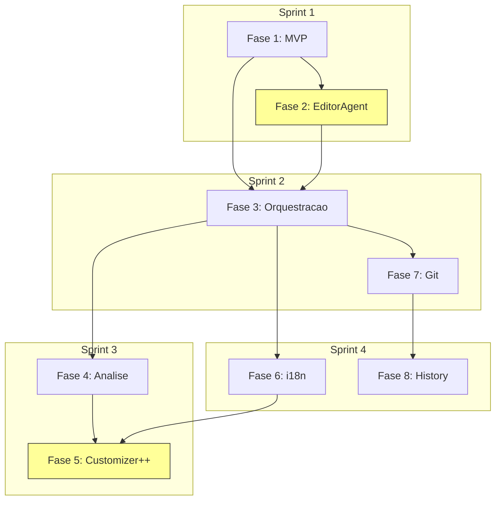

# Plano de Implementacao - CV Generator Plugin

Este documento detalha o planejamento de implementacao do plugin Claude Code para geracao de curriculos, considerando tamanho de contexto, quantidade de prompts e ordem de prioridade.

**Ultima atualizacao:** 2026-01-23
**Versao do plano:** 1.1

---

## 1. Visao Geral do Escopo

### 1.1 Componentes a Implementar

| Categoria | Componente | Prioridade | Complexidade | Modelo |
|-----------|------------|------------|--------------|--------|
| **Nivel 1** | CVOrchestratorAgent | Alta | Alta | Sonnet |
| **Nivel 2** | IngestionFlowOrchestrator | Alta | Media | Haiku |
| **Nivel 2** | AnalysisFlowOrchestrator | Alta | Media | Sonnet |
| **Nivel 2** | ExportFlowOrchestrator | Alta | Media | Haiku |
| **Nivel 2** | GitFlowOrchestrator | Media | Baixa | Haiku |
| **Nivel 2** | **EditFlowOrchestrator** | **Alta** | **Media** | **Sonnet** |
| **Nivel 3** | IngestorAgent | Alta | Media | Haiku |
| **Nivel 3** | ValidatorAgent | Alta | Baixa | Haiku |
| **Nivel 3** | EvaluatorAgent | Media | Media | Sonnet |
| **Nivel 3** | EnricherAgent | Media | Alta | Sonnet |
| **Nivel 3** | ExporterAgent | Alta | Media | Haiku |
| **Nivel 3** | TranslatorAgent | Media | Media | Sonnet |
| **Nivel 3** | CustomizerAgent | Media | Alta | Sonnet/Opus |
| **Nivel 3** | GitAgent | Media | Baixa | Haiku |
| **Nivel 3** | **EditorAgent** | **Alta** | **Media** | **Sonnet** |
| **Skills** | 19 skills | Variada | Baixa-Media | - |
| **MCP Tools** | 8 ferramentas | Alta | Media | - |
| **Hooks** | 4 hooks | Baixa | Baixa | - |

### 1.2 Skills Completas (19 total)

| Categoria | Skill | Agente Responsavel | Modelo |
|-----------|-------|-------------------|--------|
| Ingestao | /cv-ingest | IngestorAgent | Haiku |
| Validacao | /cv-validate | ValidatorAgent | Haiku |
| Avaliacao | /cv-evaluate | EvaluatorAgent | Sonnet |
| Enriquecimento | /cv-enrich | EnricherAgent | Sonnet |
| Exportacao | /cv-export | ExporterAgent | Haiku |
| Customizacao | /cv-customize | CustomizerAgent | Sonnet |
| Traducao | /cv-translate | TranslatorAgent | Sonnet |
| Status | /cv-status | Orchestrator | Haiku |
| Historico | /cv-diff | HistoryManager | Sonnet |
| Rollback | /cv-rollback | HistoryManager | Sonnet |
| Git | /cv-commit | GitAgent | Haiku |
| Git | /cv-push | GitAgent | Haiku |
| Git | /cv-sync | GitAgent | Haiku |
| Git | /cv-branch | GitAgent | Haiku |
| **Edicao** | **/cv-add** | **EditorAgent** | **Sonnet** |
| **Edicao** | **/cv-edit** | **EditorAgent** | **Sonnet** |
| **Edicao** | **/cv-remove** | **EditorAgent** | **Haiku** |
| **Edicao** | **/cv-reorder** | **EditorAgent** | **Haiku** |
| **Edicao** | **/cv-list** | **EditorAgent** | **Haiku** |

### 1.3 Metricas de Contexto Atualizadas

```
Estimativa de Tokens por Componente:
=====================================

Agentes (prompt de definicao):
- Orchestrator:       ~2,500 tokens
- Flow Orchestrators: ~1,500 tokens cada (x5 = 7,500)
- Subagentes:         ~1,200 tokens cada (x9 = 10,800)
- EditorAgent:        ~3,000 tokens (maior devido a cobertura completa)

Skills (prompt de definicao):
- Skills simples:     ~400 tokens cada (x9 = 3,600)
- Skills complexas:   ~800 tokens cada (x10 = 8,000)

MCP Tools (codigo TypeScript):
- Tool simples:       ~300 tokens cada (x4 = 1,200)
- Tool complexa:      ~600 tokens cada (x4 = 2,400)

Configuracao:
- settings.local.json:       ~500 tokens
- agent-registry.yaml:       ~3,000 tokens (expandido)
- agent-communication.yaml:  ~1,500 tokens
- hooks:                     ~400 tokens

TOTAL ESTIMADO: ~44,400 tokens de definicao
=====================================
```

### 1.4 Secoes do CV Cobertas pelo EditorAgent

```
SECOES JSON RESUME STANDARD (12):
├── basics        → Informacoes pessoais, contato, profiles
├── work          → Experiencias profissionais
├── education     → Formacao academica
├── skills        → Habilidades tecnicas e soft
├── certificates  → Certificacoes profissionais
├── awards        → Premios e reconhecimentos
├── publications  → Publicacoes cientificas
├── projects      → Projetos pessoais/profissionais
├── languages     → Idiomas e proficiencia
├── volunteer     → Trabalho voluntario
├── interests     → Interesses e hobbies
└── references    → Referencias profissionais

SECOES CUSTOMIZADAS (3):
├── x-atsData     → Keywords ATS, achievements
├── x-custom      → Objetivos, disponibilidade, timeline
└── meta          → Versao, idioma (auto-update)

TOTAL: 15 secoes editaveis
```

---

## 2. Fases de Implementacao

### Fase 1: Fundacao (MVP)
**Objetivo:** Sistema funcional minimo para importar, validar e exportar CV

```
Duracao Estimada: 1 sessao de desenvolvimento
Contexto Necessario: ~8,000 tokens
Prompts Estimados: 12-15

Componentes:
├── CVOrchestratorAgent (parcial)
├── IngestorAgent
├── ValidatorAgent
├── ExporterAgent
├── Skills:
│   ├── /cv-ingest
│   ├── /cv-validate
│   ├── /cv-export
│   └── /cv-status
└── MCP Tools:
    ├── FileParser
    ├── SchemaValidator
    └── PDFGenerator
```

**Prompts da Fase 1:**

| # | Prompt | Tokens Est. | Modelo |
|---|--------|-------------|--------|
| 1 | Criar estrutura base .claude/ | 300 | Haiku |
| 2 | Definir CVOrchestratorAgent | 2,500 | Sonnet |
| 3 | Definir IngestorAgent | 1,200 | Sonnet |
| 4 | Definir ValidatorAgent | 1,000 | Haiku |
| 5 | Definir ExporterAgent | 1,200 | Sonnet |
| 6 | Criar skill /cv-ingest | 600 | Haiku |
| 7 | Criar skill /cv-validate | 400 | Haiku |
| 8 | Criar skill /cv-export | 600 | Haiku |
| 9 | Criar skill /cv-status | 400 | Haiku |
| 10 | Implementar FileParser MCP | 500 | Sonnet |
| 11 | Implementar SchemaValidator MCP | 400 | Haiku |
| 12 | Implementar PDFGenerator MCP | 500 | Sonnet |
| 13 | Configurar settings.local.json | 300 | Haiku |
| 14 | Testar fluxo completo | 800 | Sonnet |
| 15 | Ajustes e correcoes | 500 | Sonnet |

**Total Fase 1:** ~11,200 tokens | 15 prompts

---

### Fase 2: EditorAgent + EditFlow (Prioridade 1.2)
**Objetivo:** CRUD completo de TODAS as secoes do CV

> ⚠️ **PRIORIDADE ALTA** - Movido para Fase 2 por ser funcionalidade core

```
Duracao Estimada: 1-2 sessoes de desenvolvimento
Contexto Necessario: ~12,000 tokens
Prompts Estimados: 15-18

Componentes:
├── EditorAgent (cobertura completa - 15 secoes)
├── EditFlowOrchestrator
├── Skills:
│   ├── /cv-add
│   ├── /cv-edit
│   ├── /cv-remove
│   ├── /cv-reorder
│   └── /cv-list
└── Integracoes:
    ├── ValidatorAgent (validacao inline)
    ├── TranslatorAgent (auto-traducao)
    └── EnricherAgent (sugestao keywords)
```

**Prompts da Fase 2:**

| # | Prompt | Tokens Est. | Modelo |
|---|--------|-------------|--------|
| 1 | Definir EditorAgent (todas as secoes) | 3,000 | Sonnet |
| 2 | Definir EditFlowOrchestrator | 1,500 | Sonnet |
| 3 | Criar skill /cv-add (modo interativo) | 1,000 | Sonnet |
| 4 | Criar skill /cv-edit (por ID ou secao) | 1,000 | Sonnet |
| 5 | Criar skill /cv-remove (com confirmacao) | 500 | Haiku |
| 6 | Criar skill /cv-reorder (por criterio) | 500 | Haiku |
| 7 | Criar skill /cv-list (com formatos) | 400 | Haiku |
| 8 | Implementar validacao inline | 800 | Sonnet |
| 9 | Implementar auto-traducao | 800 | Sonnet |
| 10 | Implementar sugestao de keywords | 600 | Sonnet |
| 11 | Criar fluxo de preview antes de salvar | 500 | Haiku |
| 12 | Implementar edicao de basics (profiles, location) | 600 | Sonnet |
| 13 | Implementar edicao de x-atsData | 500 | Sonnet |
| 14 | Implementar edicao de x-custom | 400 | Haiku |
| 15 | Testar CRUD em todas as secoes | 1,000 | Sonnet |
| 16 | Ajustes e correcoes | 500 | Sonnet |

**Total Fase 2:** ~13,600 tokens | 16 prompts

**Secoes Cobertas nesta Fase:**

| Secao | Operacoes | Validacoes | Auto-Traducao |
|-------|-----------|------------|---------------|
| basics | edit | email, phone, URL | Sim (summary) |
| basics.profiles | add, edit, remove | URL, network | Nao |
| basics.location | edit | countryCode, postalCode | Nao |
| work | add, edit, remove, reorder | dates, required fields | Sim |
| education | add, edit, remove, reorder | dates, studyType enum | Sim |
| skills | add, edit, remove, reorder | level enum | Nao |
| certificates | add, edit, remove, reorder | date, URL | Nao |
| awards | add, edit, remove | date | Sim (summary) |
| publications | add, edit, remove | date, URL | Sim (summary) |
| projects | add, edit, remove, reorder | dates, type enum | Sim |
| languages | add, edit, remove | fluency enum | Nao |
| volunteer | add, edit, remove, reorder | dates | Sim |
| interests | add, edit, remove | - | Nao |
| references | add, edit, remove | - | Sim |
| x-atsData | edit | - | Nao |
| x-custom | edit | - | Sim (objectives) |
| meta | auto-update | semver, datetime | Nao |

---

### Fase 3: Orquestracao Hierarquica
**Objetivo:** Implementar sub-orquestradores de fluxo restantes

```
Duracao Estimada: 1 sessao de desenvolvimento
Contexto Necessario: ~7,000 tokens (+ contexto fases anteriores)
Prompts Estimados: 10-12

Componentes:
├── IngestionFlowOrchestrator
├── ExportFlowOrchestrator
├── Regras de comunicacao direta
└── Configuracao de paralelizacao
```

**Prompts da Fase 3:**

| # | Prompt | Tokens Est. | Modelo |
|---|--------|-------------|--------|
| 1 | Definir IngestionFlowOrchestrator | 1,500 | Sonnet |
| 2 | Definir ExportFlowOrchestrator | 1,500 | Sonnet |
| 3 | Criar agent-communication.yaml | 1,000 | Haiku |
| 4 | Criar parallelization.yaml | 500 | Haiku |
| 5 | Atualizar CVOrchestrator para delegacao | 1,000 | Sonnet |
| 6 | Implementar comunicacao Ingestor <-> Validator | 600 | Sonnet |
| 7 | Implementar comunicacao Exporter <-> Translator | 600 | Sonnet |
| 8 | Implementar comunicacao Editor <-> Validator | 600 | Sonnet |
| 9 | Implementar comunicacao Editor <-> Translator | 600 | Sonnet |
| 10 | Testar fluxos paralelos | 800 | Sonnet |

**Total Fase 3:** ~8,700 tokens | 10 prompts

---

### Fase 4: Analise e Enriquecimento
**Objetivo:** Avaliacao de qualidade e otimizacao ATS

```
Duracao Estimada: 1-2 sessoes de desenvolvimento
Contexto Necessario: ~10,000 tokens
Prompts Estimados: 12-15

Componentes:
├── AnalysisFlowOrchestrator
├── EvaluatorAgent
├── EnricherAgent
├── Skills:
│   ├── /cv-evaluate
│   └── /cv-enrich
└── MCP Tools:
    └── KeywordExtractor
```

**Prompts da Fase 4:**

| # | Prompt | Tokens Est. | Modelo |
|---|--------|-------------|--------|
| 1 | Definir AnalysisFlowOrchestrator | 1,500 | Sonnet |
| 2 | Definir EvaluatorAgent | 1,500 | Sonnet |
| 3 | Definir EnricherAgent | 1,800 | Sonnet |
| 4 | Criar skill /cv-evaluate | 800 | Sonnet |
| 5 | Criar skill /cv-enrich | 800 | Sonnet |
| 6 | Implementar sistema de scoring | 1,000 | Sonnet |
| 7 | Implementar KeywordExtractor MCP | 800 | Sonnet |
| 8 | Criar base de keywords por industria | 600 | Haiku |
| 9 | Implementar comunicacao Evaluator <-> Enricher | 600 | Sonnet |
| 10 | Criar templates de sugestoes | 500 | Haiku |
| 11 | Testar avaliacao completa | 800 | Sonnet |
| 12 | Ajustar pesos de scoring | 400 | Haiku |

**Total Fase 4:** ~11,100 tokens | 12 prompts

---

### Fase 5: CustomizerAgent++ (Prioridade 1.1)
**Objetivo:** Cover letter automatica e simulacao ATS

```
Duracao Estimada: 2 sessoes de desenvolvimento
Contexto Necessario: ~14,000 tokens
Prompts Estimados: 18-20

Componentes:
├── CustomizerAgent (upgrade para ++)
├── Skills:
│   ├── /cv-customize (upgrade)
│   ├── /cv-cover-letter (nova)
│   └── /cv-ats-simulate (nova)
├── MCP Tools:
│   ├── JobMatcher (upgrade)
│   └── ATSSimulator (novo)
└── Templates:
    ├── cover_letter_formal.html
    ├── cover_letter_modern.html
    └── cover_letter_tech.html
```

**Prompts da Fase 5:**

| # | Prompt | Tokens Est. | Modelo |
|---|--------|-------------|--------|
| 1 | Atualizar CustomizerAgent para ++ | 2,000 | Opus |
| 2 | Criar skill /cv-cover-letter | 1,200 | Opus |
| 3 | Criar skill /cv-ats-simulate | 1,000 | Sonnet |
| 4 | Implementar gerador de cover letter | 1,500 | Opus |
| 5 | Criar template cover letter (formal) | 600 | Sonnet |
| 6 | Criar template cover letter (moderno) | 600 | Sonnet |
| 7 | Criar template cover letter (tecnico) | 600 | Sonnet |
| 8 | Implementar ATSSimulator MCP | 1,200 | Sonnet |
| 9 | Criar perfil ATS Workday | 500 | Haiku |
| 10 | Criar perfil ATS Greenhouse | 500 | Haiku |
| 11 | Criar perfil ATS Lever | 500 | Haiku |
| 12 | Criar perfil ATS Taleo | 500 | Haiku |
| 13 | Implementar gap analysis | 1,000 | Sonnet |
| 14 | Implementar reordenacao inteligente | 800 | Sonnet |
| 15 | Implementar sugestao de melhorias | 800 | Opus |
| 16 | Testar cover letter completo | 800 | Sonnet |
| 17 | Testar simulacao ATS | 800 | Sonnet |
| 18 | Ajustes e otimizacoes | 500 | Sonnet |

**Total Fase 5:** ~15,400 tokens | 18 prompts

---

### Fase 6: Traducao e i18n
**Objetivo:** Suporte completo a multiplos idiomas

```
Duracao Estimada: 1 sessao de desenvolvimento
Contexto Necessario: ~6,000 tokens
Prompts Estimados: 8-10

Componentes:
├── TranslatorAgent
├── Skills:
│   └── /cv-translate
├── MCP Tools:
│   └── TranslationEngine
└── Glossarios:
    ├── tech_terms.yaml
    └── preserve_english.yaml
```

**Prompts da Fase 6:**

| # | Prompt | Tokens Est. | Modelo |
|---|--------|-------------|--------|
| 1 | Definir TranslatorAgent | 1,500 | Sonnet |
| 2 | Criar skill /cv-translate | 800 | Sonnet |
| 3 | Implementar TranslationEngine MCP | 1,000 | Sonnet |
| 4 | Criar dicionario de termos tecnicos | 800 | Haiku |
| 5 | Criar lista de termos a preservar em ingles | 400 | Haiku |
| 6 | Implementar preservacao de termos | 600 | Sonnet |
| 7 | Criar glossario pt-BR <-> en-US | 500 | Haiku |
| 8 | Testar traducao bidirecional | 800 | Sonnet |
| 9 | Ajustar qualidade de traducao | 500 | Sonnet |

**Total Fase 6:** ~6,900 tokens | 9 prompts

---

### Fase 7: Git Integration
**Objetivo:** Versionamento completo com Git/GitHub

```
Duracao Estimada: 1 sessao de desenvolvimento
Contexto Necessario: ~5,500 tokens
Prompts Estimados: 10-12

Componentes:
├── GitFlowOrchestrator
├── GitAgent
├── Skills:
│   ├── /cv-commit
│   ├── /cv-push
│   ├── /cv-sync
│   └── /cv-branch
├── MCP Tools:
│   └── GitOperations
└── Hooks:
    ├── pre-commit.sh
    ├── post-commit.sh
    └── pre-push.sh
```

**Prompts da Fase 7:**

| # | Prompt | Tokens Est. | Modelo |
|---|--------|-------------|--------|
| 1 | Definir GitFlowOrchestrator | 1,000 | Haiku |
| 2 | Definir GitAgent | 1,000 | Haiku |
| 3 | Criar skill /cv-commit | 500 | Haiku |
| 4 | Criar skill /cv-push | 400 | Haiku |
| 5 | Criar skill /cv-sync | 400 | Haiku |
| 6 | Criar skill /cv-branch | 500 | Haiku |
| 7 | Implementar GitOperations MCP | 600 | Sonnet |
| 8 | Criar hook pre-commit (validacao) | 300 | Haiku |
| 9 | Criar hook post-commit (notificacao) | 200 | Haiku |
| 10 | Criar hook pre-push (validacao remota) | 300 | Haiku |
| 11 | Testar fluxo Git completo | 600 | Sonnet |

**Total Fase 7:** ~5,800 tokens | 11 prompts

---

### Fase 8: Historico e Rollback
**Objetivo:** HistoryManager e capacidade de rollback

```
Duracao Estimada: 1 sessao de desenvolvimento
Contexto Necessario: ~5,000 tokens
Prompts Estimados: 8-10

Componentes:
├── HistoryManager
├── Skills:
│   ├── /cv-diff
│   └── /cv-rollback
└── Sistema de snapshots
```

**Prompts da Fase 8:**

| # | Prompt | Tokens Est. | Modelo |
|---|--------|-------------|--------|
| 1 | Definir HistoryManager | 1,200 | Sonnet |
| 2 | Criar skill /cv-diff | 600 | Sonnet |
| 3 | Criar skill /cv-rollback | 600 | Sonnet |
| 4 | Implementar sistema de snapshots | 800 | Sonnet |
| 5 | Criar visualizacao de diff | 500 | Haiku |
| 6 | Implementar rollback granular | 800 | Sonnet |
| 7 | Testar historico completo | 600 | Sonnet |
| 8 | Documentar uso | 300 | Haiku |

**Total Fase 8:** ~5,400 tokens | 8 prompts

---

## 3. Resumo de Implementacao

### 3.1 Totais por Fase

| Fase | Descricao | Tokens | Prompts | Modelo Dominante | Prioridade |
|------|-----------|--------|---------|------------------|------------|
| 1 | Fundacao (MVP) | 11,200 | 15 | Haiku/Sonnet | Core |
| 2 | **EditorAgent + EditFlow** | **13,600** | **16** | **Sonnet** | **1.2** |
| 3 | Orquestracao Hierarquica | 8,700 | 10 | Sonnet | Core |
| 4 | Analise e Enriquecimento | 11,100 | 12 | Sonnet | 1.3 |
| 5 | **CustomizerAgent++** | **15,400** | **18** | **Opus** | **1.1** |
| 6 | Traducao e i18n | 6,900 | 9 | Sonnet | 1.4 |
| 7 | Git Integration | 5,800 | 11 | Haiku | 1.5 |
| 8 | Historico e Rollback | 5,400 | 8 | Sonnet | 1.3 |
| **TOTAL** | | **78,100** | **99** | | |

### 3.2 Distribuicao por Modelo

```
┌─────────────────────────────────────────────────────────────┐
│                  DISTRIBUICAO DE PROMPTS                    │
├─────────────────────────────────────────────────────────────┤
│                                                             │
│  🟢 Haiku (simples):     ~35 prompts (35%)  - Custo: $     │
│  ████████████████░░░░░░░░░░░░░░░░░░░░░░░░░                 │
│                                                             │
│  🟡 Sonnet (moderado):   ~55 prompts (56%)  - Custo: $$    │
│  ████████████████████████████░░░░░░░░░░░░░                 │
│                                                             │
│  🔴 Opus (complexo):     ~9 prompts  (9%)   - Custo: $$$   │
│  █████░░░░░░░░░░░░░░░░░░░░░░░░░░░░░░░░░░░░                 │
│                                                             │
└─────────────────────────────────────────────────────────────┘

Economia estimada vs. tudo Opus: ~65%
```

### 3.3 Ordem de Implementacao Recomendada

```
SPRINT 1 (Semana 1):
├── Fase 1: Fundacao (MVP) ✓ Sistema funcional basico
└── Fase 2: EditorAgent + EditFlow (Prioridade 1.2)
    └── CRUD completo para todas as 15 secoes do CV

SPRINT 2 (Semana 2):
├── Fase 3: Orquestracao Hierarquica
└── Fase 7: Git Integration
    └── Versionamento funcional

SPRINT 3 (Semana 3):
├── Fase 5: CustomizerAgent++ (Prioridade 1.1)
│   ├── Cover letter automatica
│   └── Simulacao ATS
└── Fase 4: Analise e Enriquecimento
    └── Scoring e keywords

SPRINT 4 (Semana 4):
├── Fase 6: Traducao e i18n
│   └── Suporte pt-BR / en-US
└── Fase 8: Historico e Rollback
    └── Snapshots e diff
```

---

## 4. Dependencias entre Componentes



### 4.1 Matriz de Dependencias

| Componente | Depende de | Usado por |
|------------|-----------|-----------|
| CVOrchestrator | - | Todos |
| IngestorAgent | ValidatorAgent | - |
| ValidatorAgent | - | Ingestor, Editor, Git |
| ExporterAgent | TranslatorAgent | - |
| **EditorAgent** | **Validator, Translator, Enricher** | **-** |
| EvaluatorAgent | - | Enricher |
| EnricherAgent | Evaluator | Editor, Customizer |
| CustomizerAgent | Enricher, Translator | - |
| TranslatorAgent | - | Exporter, Editor |
| GitAgent | Validator | - |
| HistoryManager | GitAgent | - |

---

## 5. Checklist de Implementacao

### Fase 1: Fundacao
- [ ] Criar estrutura .claude/
- [ ] Definir CVOrchestratorAgent
- [ ] Definir IngestorAgent
- [ ] Definir ValidatorAgent
- [ ] Definir ExporterAgent
- [ ] Criar skills basicas (/cv-ingest, /cv-validate, /cv-export, /cv-status)
- [ ] Implementar MCP Tools (FileParser, SchemaValidator, PDFGenerator)
- [ ] Configurar settings.local.json
- [ ] Testar fluxo completo

### Fase 2: EditorAgent + EditFlow
- [ ] Definir EditorAgent (todas as 15 secoes)
- [ ] Definir EditFlowOrchestrator
- [ ] Criar skill /cv-add (modo interativo)
- [ ] Criar skill /cv-edit (por ID ou secao)
- [ ] Criar skill /cv-remove (com confirmacao)
- [ ] Criar skill /cv-reorder (por criterio)
- [ ] Criar skill /cv-list (com formatos)
- [ ] Implementar validacao inline
- [ ] Implementar auto-traducao
- [ ] Testar CRUD em todas as secoes:
  - [ ] basics (name, email, summary, location, profiles)
  - [ ] work
  - [ ] education
  - [ ] skills
  - [ ] certificates
  - [ ] awards
  - [ ] publications
  - [ ] projects
  - [ ] languages
  - [ ] volunteer
  - [ ] interests
  - [ ] references
  - [ ] x-atsData
  - [ ] x-custom
  - [ ] meta

### Fase 3: Orquestracao Hierarquica
- [ ] Definir IngestionFlowOrchestrator
- [ ] Definir ExportFlowOrchestrator
- [ ] Criar agent-communication.yaml
- [ ] Criar parallelization.yaml
- [ ] Implementar comunicacoes diretas
- [ ] Testar fluxos paralelos

### Fase 4: Analise e Enriquecimento
- [ ] Definir AnalysisFlowOrchestrator
- [ ] Definir EvaluatorAgent
- [ ] Definir EnricherAgent
- [ ] Criar skills (/cv-evaluate, /cv-enrich)
- [ ] Implementar KeywordExtractor MCP
- [ ] Testar avaliacao completa

### Fase 5: CustomizerAgent++
- [ ] Atualizar CustomizerAgent
- [ ] Criar skill /cv-cover-letter
- [ ] Criar skill /cv-ats-simulate
- [ ] Implementar ATSSimulator MCP
- [ ] Criar templates cover letter (3 tipos)
- [ ] Criar perfis ATS (Workday, Greenhouse, Lever, Taleo)
- [ ] Testar cover letter
- [ ] Testar simulacao ATS

### Fase 6: Traducao e i18n
- [ ] Definir TranslatorAgent
- [ ] Criar skill /cv-translate
- [ ] Implementar TranslationEngine MCP
- [ ] Criar glossarios de termos
- [ ] Testar traducao bidirecional

### Fase 7: Git Integration
- [ ] Definir GitFlowOrchestrator
- [ ] Definir GitAgent
- [ ] Criar skills Git (/cv-commit, /cv-push, /cv-sync, /cv-branch)
- [ ] Implementar GitOperations MCP
- [ ] Criar hooks Git
- [ ] Testar fluxo Git

### Fase 8: Historico e Rollback
- [ ] Definir HistoryManager
- [ ] Criar skill /cv-diff
- [ ] Criar skill /cv-rollback
- [ ] Implementar snapshots
- [ ] Testar rollback

---

## 6. Notas de Implementacao

### 6.1 Consideracoes de Contexto

- **Limite de contexto recomendado por sessao:** ~15,000 tokens
- **Estrategia:** Dividir implementacao em sessoes focadas por fase
- **Reutilizacao:** Agentes ja definidos podem ser referenciados sem re-envio completo

### 6.2 Otimizacao de Prompts

```yaml
estrategias:
  - Usar Haiku para tarefas estruturadas (configs, validacoes, CRUD simples)
  - Usar Sonnet para analise e geracao moderada
  - Reservar Opus para tarefas criativas (cover letter, sugestoes, analise profunda)
  - Agrupar prompts similares na mesma sessao
  - Manter contexto entre prompts relacionados
```

### 6.3 Prioridades do Roadmap

| Versao | Componente | Descricao | Fase |
|--------|------------|-----------|------|
| 1.0 | Core + MVP | Agentes basicos, skills principais | 1, 3 |
| 1.1 | CustomizerAgent++ | Cover letter, simulacao ATS | 5 |
| 1.2 | EditorAgent | CRUD completo (15 secoes) | 2 |
| 1.3 | HistoryManager | Rollback, diff, snapshots | 8 |
| 1.4 | TranslatorAgent | i18n completo | 6 |
| 1.5 | GitAgent | Versionamento Git | 7 |

### 6.4 Testes Recomendados

Cada fase deve incluir testes de:
1. **Unidade:** Cada agente/skill individualmente
2. **Integracao:** Fluxo entre agentes
3. **End-to-end:** Cenario completo do usuario

**Cenarios de Teste para EditorAgent:**
```
1. Adicionar experiencia profissional → validar → traduzir
2. Editar certificado existente por ID
3. Remover publicacao com confirmacao
4. Reordenar skills por relevancia
5. Listar todas as secoes em formato tabela
6. Editar basics.profiles (adicionar GitHub)
7. Atualizar x-atsData.keywords
```

---

*Documento gerado em: 2026-01-23*
*Versao do plano: 1.1*
*Ultima atualizacao: Adicao de EditorAgent com cobertura completa de 15 secoes*
