# Processos, Subprocessos e Regras de Negocio

Este documento descreve os processos completos do sistema de geracao de curriculo, desde a entrada de dados ate a exportacao final customizada.

---

## Indice

1. [Visao Geral do Sistema](#1-visao-geral-do-sistema)
2. [P1 - Processo de Ingestao de Dados](#2-p1---processo-de-ingestao-de-dados)
3. [P2 - Processo de Avaliacao de Conteudo](#3-p2---processo-de-avaliacao-de-conteudo)
4. [P3 - Processo de Geracao de Conhecimento](#4-p3---processo-de-geracao-de-conhecimento)
5. [P4 - Processo de Geracao da Base de Dados](#5-p4---processo-de-geracao-da-base-de-dados)
6. [P5 - Processo de Ajustes nos Dados](#6-p5---processo-de-ajustes-nos-dados)
7. [P6 - Processo de Validacao](#7-p6---processo-de-validacao)
8. [P7 - Processo de Exportacao](#8-p7---processo-de-exportacao)
9. [P8 - Processo de Customizacao por Vaga](#9-p8---processo-de-customizacao-por-vaga)
10. [Regras de Negocio](#10-regras-de-negocio)
11. [Matriz de Checkpoints](#11-matriz-de-checkpoints)

---

## 1. Visao Geral do Sistema

### 1.1 Fluxo Macro do Sistema

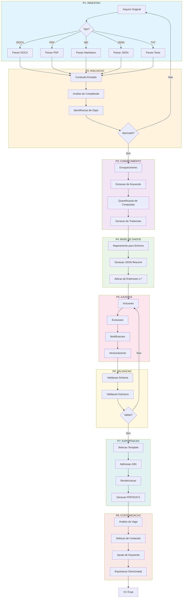

### 1.2 Atores do Sistema

| Ator | Responsabilidade |
|------|------------------|
| Usuario | Fornece dados iniciais e aprova ajustes |
| Sistema de Ingestao | Parseia arquivos de entrada |
| Motor de Avaliacao | Analisa completude e qualidade |
| Motor de Enriquecimento | Gera conhecimento adicional (keywords, traducoes) |
| Validador | Garante conformidade com schema e regras |
| Exportador | Gera arquivos de saida (PDF, DOCX) |
| CI/CD (GitHub Actions) | Automatiza validacoes em cada commit |

---

## 2. P1 - Processo de Ingestao de Dados

### 2.1 Objetivo
Receber arquivo de entrada em diversos formatos e extrair conteudo estruturado.

### 2.2 Diagrama de Processo

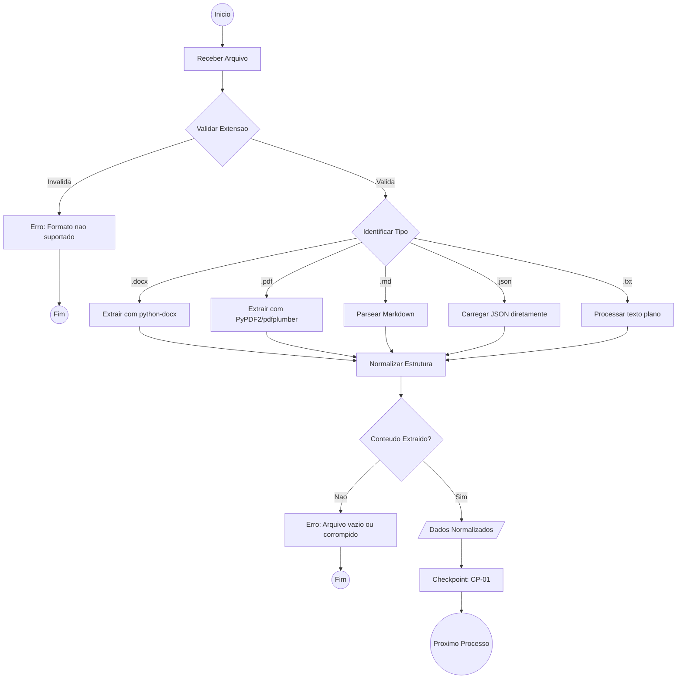

### 2.3 Subprocessos

#### SP1.1 - Parser DOCX
1. Abrir documento com python-docx
2. Extrair paragrafos e tabelas
3. Identificar secoes por formatacao (titulos, negrito)
4. Mapear conteudo para estrutura intermediaria

#### SP1.2 - Parser PDF
1. Tentar extracao de texto com PyPDF2
2. Se falhar, usar pdfplumber para layout complexo
3. Se PDF for imagem, aplicar OCR (opcional)
4. Reconstruir estrutura de secoes

#### SP1.3 - Parser Markdown
1. Parsear com biblioteca markdown
2. Identificar headers como secoes
3. Extrair listas e paragrafos
4. Preservar links e formatacao basica

#### SP1.4 - Parser JSON
1. Validar JSON sintatico
2. Detectar se e JSON Resume ou formato customizado
3. Mapear campos para estrutura interna
4. Preservar extensoes x-* se existentes

### 2.4 Regras de Negocio - Ingestao

| ID | Regra | Validacao |
|----|-------|-----------|
| RN-I01 | Formatos aceitos: .docx, .pdf, .md, .json, .txt | Verificar extensao do arquivo |
| RN-I02 | Tamanho maximo: 10MB | Verificar tamanho antes do parse |
| RN-I03 | Encoding: UTF-8 obrigatorio | Detectar e converter se necessario |
| RN-I04 | Arquivo deve conter ao menos nome e email | Validar campos minimos |

### 2.5 Checkpoint CP-01: Ingestao Completa

| Criterio | Obrigatorio | Verificacao |
|----------|-------------|-------------|
| Arquivo lido sem erros | Sim | Nenhuma excecao durante parse |
| Conteudo nao vazio | Sim | Texto extraido > 100 caracteres |
| Nome identificado | Sim | Campo name preenchido |
| Email identificado | Sim | Campo email valido |
| Secoes mapeadas | Nao | Ao menos 1 secao reconhecida |

---

## 3. P2 - Processo de Avaliacao de Conteudo

### 3.1 Objetivo
Analisar a qualidade e completude do conteudo extraido, identificando gaps e pontos de melhoria.

### 3.2 Diagrama de Processo

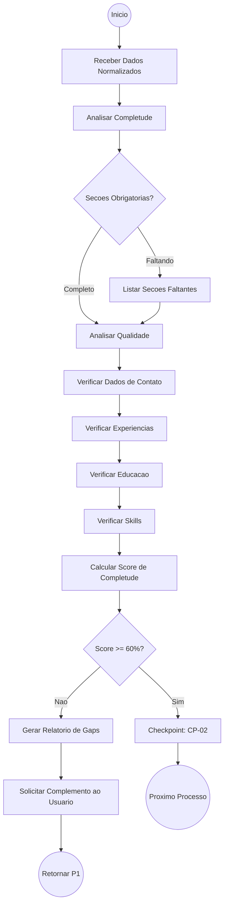

### 3.3 Metricas de Avaliacao

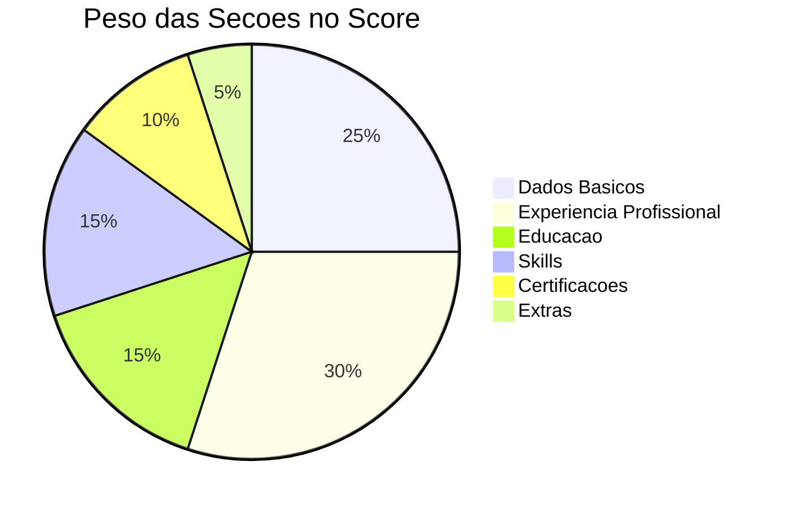

### 3.4 Subprocessos

#### SP2.1 - Analise de Completude
```
Para cada secao obrigatoria:
  - Verificar presenca
  - Contar itens
  - Validar campos minimos

Score = (secoes_presentes / secoes_totais) * peso
```

#### SP2.2 - Analise de Qualidade
```
Para cada experiencia profissional:
  - Verificar se tem descricao (summary)
  - Verificar se tem highlights/conquistas
  - Verificar se tem datas validas
  - Verificar se tem keywords

Qualidade = media(completude_experiencias)
```

### 3.5 Regras de Negocio - Avaliacao

| ID | Regra | Validacao |
|----|-------|-----------|
| RN-A01 | Secoes obrigatorias: basics, work, education, skills | Todas devem estar presentes |
| RN-A02 | Minimo 1 experiencia profissional | work.length >= 1 |
| RN-A03 | Minimo 1 formacao academica | education.length >= 1 |
| RN-A04 | Minimo 3 categorias de skills | skills.length >= 3 |
| RN-A05 | Score minimo para prosseguir: 60% | score >= 0.6 |
| RN-A06 | Experiencias devem ter datas | startDate obrigatorio |

### 3.6 Checkpoint CP-02: Avaliacao Aprovada

| Criterio | Obrigatorio | Verificacao |
|----------|-------------|-------------|
| Score >= 60% | Sim | Calculo automatico |
| Sem campos criticos vazios | Sim | name, email, work[0], education[0] |
| Datas consistentes | Sim | endDate >= startDate ou null |
| Email valido | Sim | Regex de email |
| Telefone formatado | Nao | Regex de telefone |

---

## 4. P3 - Processo de Geracao de Conhecimento

### 4.1 Objetivo
Enriquecer os dados extraidos com informacoes adicionais: keywords ATS, traducoes, metricas.

### 4.2 Diagrama de Processo

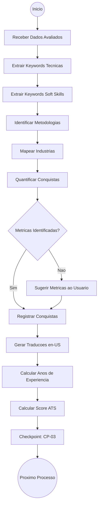

### 4.3 Subprocessos

#### SP3.1 - Extracao de Keywords
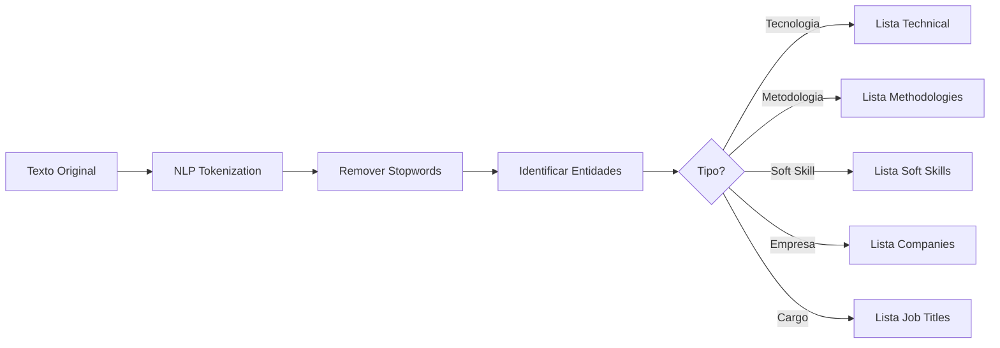

**Categorias de Keywords:**
- `primary`: Titulos de cargo alvo (Data Engineer, BI Developer)
- `technical`: Tecnologias e ferramentas (Python, Power BI, SQL)
- `soft`: Competencias comportamentais (Leadership, Problem Solving)
- `methodologies`: Metodologias e frameworks (Agile, Lean Six Sigma)
- `industries`: Setores de atuacao (Mining, Healthcare, Consulting)
- `certifications`: Certificacoes reconhecidas (ISTQB, PL-300)
- `companies`: Empresas mencionadas (Vale, Progen)
- `jobTitles`: Cargos ocupados (Senior Analyst, Consultant)

#### SP3.2 - Quantificacao de Conquistas
```
Entrada: "Ganho de 80% em performance no fechamento mensal"

Saida:
{
  "description": "80% performance improvement",
  "metric": "Time reduction",
  "context": "Power BI implementation",
  "verified": true
}
```

**Padroes de Metricas Reconhecidos:**
- Percentuais: "aumento de X%", "reducao de Y%"
- Quantidades: "X usuarios", "Y projetos", "Z obras"
- Tempo: "em X meses", "reducao de X horas"
- Financeiro: "economia de R$ X", "faturamento de Y"

#### SP3.3 - Geracao de Traducoes
```
Para cada item traduzivel (basics, work, education, awards, certificates):
  1. Identificar campos de texto
  2. Traduzir usando regras ou API
  3. Armazenar em x-i18n.{locale}.{entidade}.{id}
```

### 4.4 Regras de Negocio - Conhecimento

| ID | Regra | Validacao |
|----|-------|-----------|
| RN-K01 | Minimo 30 keywords tecnicas | technical.length >= 30 |
| RN-K02 | Minimo 10 soft skills | soft.length >= 10 |
| RN-K03 | Todas experiencias devem ter keywords | work[*].keywords.length > 0 |
| RN-K04 | Conquistas quantificadas preferidas | Pelo menos 3 metricas |
| RN-K05 | Traducao en-US obrigatoria | x-i18n.en-US preenchido |
| RN-K06 | Anos de experiencia calculados | yearsOfExperience.total > 0 |

### 4.5 Checkpoint CP-03: Conhecimento Gerado

| Criterio | Obrigatorio | Verificacao |
|----------|-------------|-------------|
| x-atsData preenchido | Sim | Objeto nao vazio |
| Keywords extraidas | Sim | >= 50 keywords unicas |
| Traducoes geradas | Sim | x-i18n.en-US existe |
| Anos calculados | Sim | yearsOfExperience definido |
| Score ATS calculado | Nao | meta.ats.score.overall |

---

## 5. P4 - Processo de Geracao da Base de Dados

### 5.1 Objetivo
Transformar os dados enriquecidos no formato final JSON Resume com extensoes.

### 5.2 Diagrama de Processo

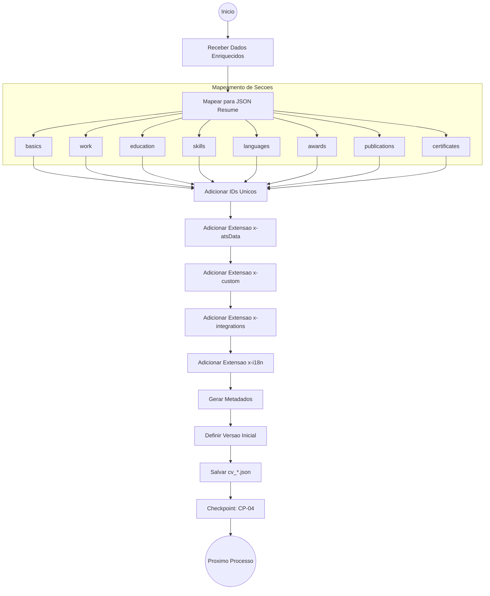

### 5.3 Estrutura do Arquivo Gerado

```
cv_ed_costa.json
├── $schema (referencia ao JSON Resume)
├── $id (identificador unico)
├── meta
│   ├── version (semver)
│   ├── lastModified (ISO 8601)
│   ├── language (locale principal)
│   ├── locales (lista de idiomas)
│   ├── theme
│   ├── format
│   ├── generator
│   └── ats (scores e compatibilidade)
├── basics (dados pessoais)
├── work[] (experiencias)
├── education[] (formacao)
├── skills[] (competencias)
├── languages[] (idiomas)
├── awards[] (premiacoes)
├── publications[] (publicacoes)
├── certificates[] (certificacoes)
├── x-atsData (dados ATS)
├── x-custom (objetivos, timeline)
├── x-integrations (linkedin, github)
└── x-i18n (traducoes)
```

### 5.4 Regras de Negocio - Base de Dados

| ID | Regra | Validacao |
|----|-------|-----------|
| RN-D01 | Versao inicial: 1.0.0 | Formato semver |
| RN-D02 | lastModified automatico | UTC ISO 8601 |
| RN-D03 | IDs unicos por tipo | work-XXX, edu-XXX, etc. |
| RN-D04 | Campos vazios como string vazia, nao null | "" ao inves de null para strings |
| RN-D05 | Datas no formato ISO 8601 | YYYY-MM-DD |
| RN-D06 | URLs validadas | Formato URI valido |

### 5.5 Checkpoint CP-04: Base Gerada

| Criterio | Obrigatorio | Verificacao |
|----------|-------------|-------------|
| Arquivo JSON valido | Sim | Parse sem erros |
| Schema reference presente | Sim | $schema definido |
| Meta completo | Sim | version, lastModified, language |
| Todas secoes obrigatorias | Sim | basics, work, education, skills |
| IDs unicos | Sim | Sem duplicatas |
| Extensoes x-* presentes | Sim | x-atsData, x-i18n minimo |

---

## 6. P5 - Processo de Ajustes nos Dados

### 6.1 Objetivo
Permitir inclusoes, exclusoes e modificacoes manuais nos dados do CV.

### 6.2 Diagrama de Processo

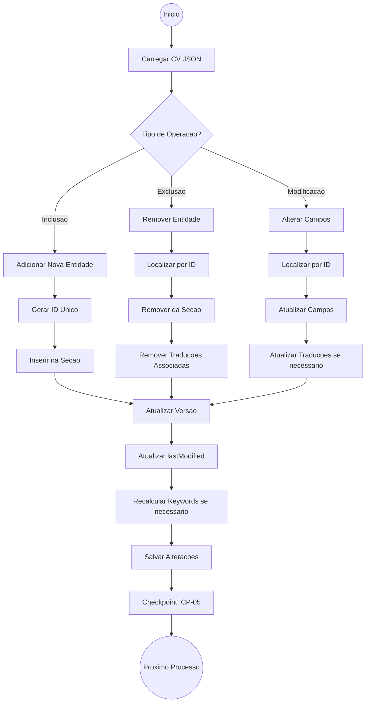

### 6.3 Subprocessos

#### SP5.1 - Inclusao de Experiencia
```
1. Gerar proximo ID disponivel (work-XXX)
2. Preencher campos obrigatorios (name, position, startDate)
3. Adicionar ao array work[]
4. Extrair keywords da descricao
5. Gerar traducao en-US
6. Incrementar versao MINOR
```

#### SP5.2 - Exclusao de Entidade
```
1. Validar que ID existe
2. Verificar se nao e ultima entidade da secao
3. Remover do array principal
4. Remover de x-i18n todas locales
5. Atualizar keywords globais
6. Incrementar versao PATCH
```

#### SP5.3 - Modificacao de Campos
```
1. Localizar entidade por ID
2. Validar novos valores
3. Atualizar campos alterados
4. Se texto alterado, regenerar traducao
5. Se keywords alteradas, recalcular ATS
6. Incrementar versao PATCH ou MINOR
```

### 6.4 Regras de Versionamento

| Tipo de Mudanca | Incremento | Exemplo |
|-----------------|------------|---------|
| Nova experiencia ou certificacao | MINOR | 2.3.0 -> 2.4.0 |
| Correcao de texto | PATCH | 2.3.0 -> 2.3.1 |
| Nova skill ou keyword | PATCH | 2.3.1 -> 2.3.2 |
| Mudanca estrutural significativa | MAJOR | 2.3.2 -> 3.0.0 |
| Mudanca de carreira/area | MAJOR | 2.3.2 -> 3.0.0 |

### 6.5 Regras de Negocio - Ajustes

| ID | Regra | Validacao |
|----|-------|-----------|
| RN-J01 | Nao deletar ultima experiencia | work.length > 1 apos delete |
| RN-J02 | Nao deletar ultima formacao | education.length > 1 apos delete |
| RN-J03 | ID imutavel apos criacao | ID nunca pode ser alterado |
| RN-J04 | lastModified sempre atualizado | Timestamp atual em UTC |
| RN-J05 | Versao sempre incrementada | Nunca decrementa |
| RN-J06 | Traducao sincronizada | Alterar pt-BR atualiza en-US |

### 6.6 Checkpoint CP-05: Ajustes Aplicados

| Criterio | Obrigatorio | Verificacao |
|----------|-------------|-------------|
| JSON ainda valido | Sim | Parse sem erros |
| Versao incrementada | Sim | version > version_anterior |
| lastModified atualizado | Sim | > lastModified_anterior |
| IDs integros | Sim | Sem IDs duplicados ou orfaos |
| Traducoes sincronizadas | Sim | x-i18n atualizado |

---

## 7. P6 - Processo de Validacao

### 7.1 Objetivo
Garantir que o CV esta em conformidade com o schema e regras de negocio antes de commit ou exportacao.

### 7.2 Diagrama de Processo

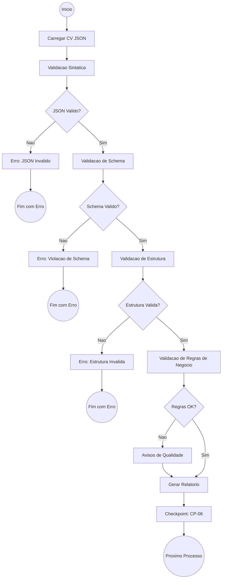

### 7.3 Camadas de Validacao

#### Camada 1: Validacao Sintatica (JSON)
```bash
# Verifica se o arquivo e um JSON valido
python -c "import json; json.load(open('cv.json'))"
```

#### Camada 2: Validacao de Schema (AJV)
```bash
# Valida contra o JSON Schema definido
ajv validate -s schema.json -d cv_ed_costa.json --spec=draft7 -c ajv-formats
```

**Verificacoes de Schema:**
- Tipos de dados corretos (string, array, object, integer)
- Formatos especiais (email, uri, date, date-time)
- Campos obrigatorios presentes
- Padroes regex (version, language code)
- Valores enum permitidos (skill level)

#### Camada 3: Validacao de Estrutura (Python)
```python
# Regras de estrutura logica
- meta.version presente
- meta.language presente
- basics.name nao vazio
- basics.email formato valido
- work[] nao vazio
- education[] nao vazio
- skills[] nao vazio
```

#### Camada 4: Validacao de Regras de Negocio
```python
# Regras de qualidade e consistencia
- Datas em ordem cronologica
- Anos de experiencia consistentes
- Keywords suficientes para ATS
- Traducoes completas
- IDs unicos e sem lacunas
```

### 7.4 Regras de Validacao Completas

| ID | Regra | Severidade | Mensagem |
|----|-------|------------|----------|
| VAL-01 | JSON sintatico valido | ERROR | JSON parse error |
| VAL-02 | $schema definido | ERROR | Missing schema reference |
| VAL-03 | meta.version formato semver | ERROR | Invalid version format |
| VAL-04 | meta.lastModified ISO 8601 | ERROR | Invalid date format |
| VAL-05 | basics.name nao vazio | ERROR | Name is required |
| VAL-06 | basics.email formato valido | ERROR | Invalid email format |
| VAL-07 | work[].startDate obrigatorio | ERROR | Start date required |
| VAL-08 | endDate >= startDate | ERROR | Invalid date range |
| VAL-09 | IDs unicos por secao | ERROR | Duplicate ID found |
| VAL-10 | Minimo 1 work entry | ERROR | At least one job required |
| VAL-11 | Minimo 1 education entry | ERROR | At least one education required |
| VAL-12 | skills[].keywords preenchido | WARNING | Skills should have keywords |
| VAL-13 | x-i18n.en-US presente | WARNING | English translation recommended |
| VAL-14 | meta.ats.score definido | WARNING | ATS score not calculated |
| VAL-15 | work[].highlights presente | WARNING | Job highlights recommended |

### 7.5 Checkpoint CP-06: Validacao Completa

| Criterio | Obrigatorio | Verificacao |
|----------|-------------|-------------|
| Zero erros (ERROR) | Sim | Nenhuma violacao critica |
| Warnings documentados | Nao | Listados mas nao bloqueiam |
| Schema 100% valido | Sim | AJV retorna sucesso |
| Estrutura 100% valida | Sim | Script Python retorna sucesso |
| Relatorio gerado | Sim | Saida de validacao disponivel |

---

## 8. P7 - Processo de Exportacao

### 8.1 Objetivo
Gerar arquivos de saida (PDF, DOCX) a partir do CV JSON usando templates.

### 8.2 Diagrama de Processo

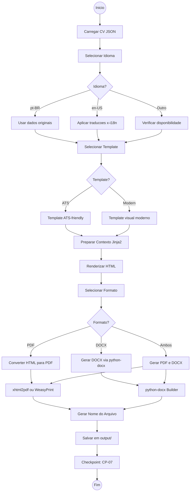

### 8.3 Templates Disponiveis

| Template | Uso Recomendado | Caracteristicas |
|----------|-----------------|-----------------|
| `ats_template.html` | Candidaturas online | Layout limpo, sem graficos, ATS-parseable |
| `modern_template.html` | Entrega direta | Visual moderno, barras de skill, cores |

### 8.4 Fluxo de Renderizacao

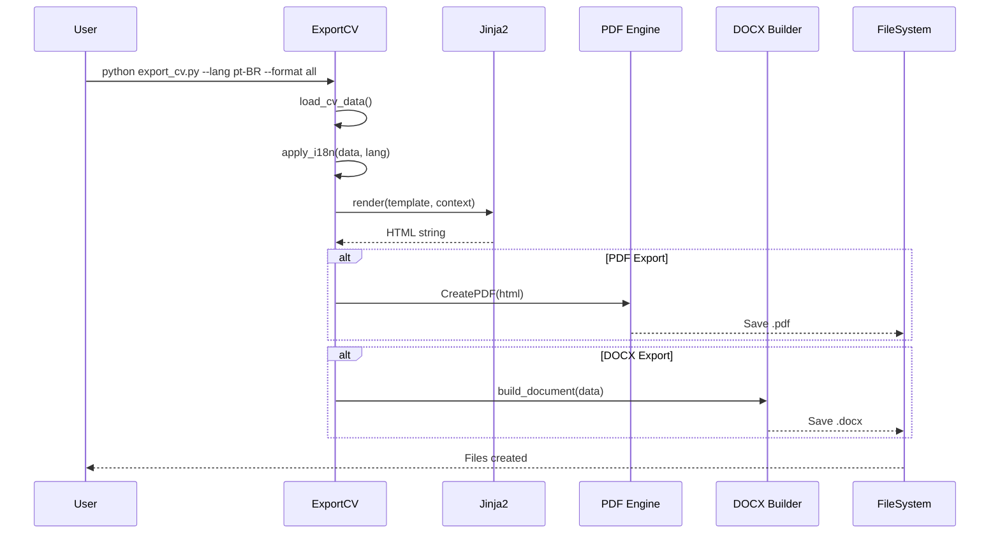

### 8.5 Nomenclatura de Arquivos

**Padrao:**
```
CV - {Nome} ({Data}) - {Idioma}.{ext}
```

**Exemplos:**
```
CV - Ed Costa (2026-01-22) - pt-BR.pdf
CV - Ed Costa (2026-01-22) - pt-BR.docx
CV - Ed Costa (2026-01-22) - en-US.pdf
CV - Ed Costa (2026-01-22) - en-US (1).pdf  # Se ja existe
```

### 8.6 Regras de Negocio - Exportacao

| ID | Regra | Validacao |
|----|-------|-----------|
| RN-E01 | PDF engine disponivel | xhtml2pdf ou weasyprint instalado |
| RN-E02 | DOCX engine disponivel | python-docx instalado |
| RN-E03 | Idioma deve existir em locales | lang in meta.locales |
| RN-E04 | Template deve existir | templates/{name}_template.html |
| RN-E05 | Nao sobrescrever arquivos | Adicionar sufixo (n) se existe |
| RN-E06 | Output dir deve existir | Criar se necessario |

### 8.7 Checkpoint CP-07: Exportacao Concluida

| Criterio | Obrigatorio | Verificacao |
|----------|-------------|-------------|
| Arquivo(s) gerado(s) | Sim | Existe no output/ |
| Tamanho > 0 bytes | Sim | Arquivo nao vazio |
| PDF abre sem erros | Sim | Validacao de integridade |
| DOCX abre sem erros | Sim | Validacao de integridade |
| Nome correto | Sim | Segue padrao de nomenclatura |

---

## 9. P8 - Processo de Customizacao por Vaga

### 9.1 Objetivo
Adaptar o CV para uma vaga especifica, destacando experiencias e skills relevantes.

### 9.2 Diagrama de Processo

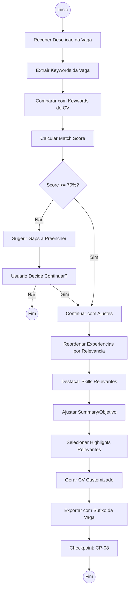

### 9.3 Algoritmo de Matching

```mermaid
flowchart LR
    subgraph VAGA ["Analise da Vaga"]
        A1[Titulo do Cargo] --> B1[Keywords Extraidas]
        A2[Requisitos] --> B1
        A3[Diferenciais] --> B1
    end

    subgraph CV ["Analise do CV"]
        C1[x-atsData.keywords] --> D1[Keywords do CV]
        C2[work[].keywords] --> D1
        C3[skills[].keywords] --> D1
    end

    B1 --> E[Interseccao]
    D1 --> E

    E --> F[Match Score]
    F --> G{Categorizar}
    G -->|>= 80%| H1[Excelente Match]
    G -->|>= 70%| H2[Bom Match]
    G -->|>= 50%| H3[Match Parcial]
    G -->|< 50%| H4[Match Fraco]
```

### 9.4 Subprocessos

#### SP8.1 - Extracao de Keywords da Vaga
```
Entrada: Texto da descricao da vaga

Processo:
1. Tokenizar texto
2. Remover stopwords
3. Identificar:
   - Tecnologias mencionadas
   - Soft skills requeridas
   - Anos de experiencia
   - Certificacoes exigidas
   - Industria/setor

Saida: Lista de keywords categorizadas
```

#### SP8.2 - Reordenacao por Relevancia
```
Para cada experiencia em work[]:
  relevancia = count(keywords_exp INTERSECT keywords_vaga)

Ordenar work[] por relevancia DESC

Mover experiencias mais relevantes para o topo
```

#### SP8.3 - Selecao de Highlights
```
Para cada highlight em work[].highlights:
  score = relevancia_para_vaga(highlight)

Selecionar top N highlights por experiencia
Considerar limite de espaco no CV
```

### 9.5 Regras de Negocio - Customizacao

| ID | Regra | Validacao |
|----|-------|-----------|
| RN-C01 | Nao remover experiencias, apenas reordenar | work.length inalterado |
| RN-C02 | Manter dados originais intactos | Gerar copia para customizacao |
| RN-C03 | Identificar vaga no nome do arquivo | CV_vaga_empresa.pdf |
| RN-C04 | Score minimo recomendado: 50% | Alertar se abaixo |
| RN-C05 | Limite de 2 paginas para CV customizado | Selecionar conteudo |
| RN-C06 | Manter cronologia dentro de cada relevancia | Ordem temporal preservada |

### 9.6 Checkpoint CP-08: Customizacao Concluida

| Criterio | Obrigatorio | Verificacao |
|----------|-------------|-------------|
| CV original preservado | Sim | Arquivo original inalterado |
| Match score calculado | Sim | Score disponivel |
| Experiencias reordenadas | Sim | Ordem por relevancia |
| Keywords destacadas | Sim | Skills relevantes no topo |
| Arquivo exportado | Sim | Nome identifica a vaga |

---

## 10. Regras de Negocio

### 10.1 Consolidacao de Regras

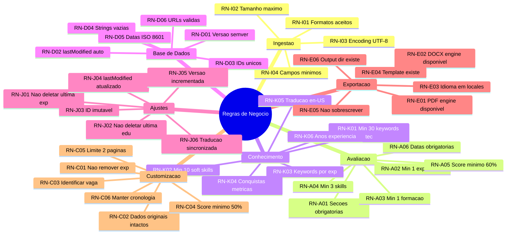

### 10.2 Matriz de Regras por Severidade

| Severidade | Regras | Acao |
|------------|--------|------|
| **BLOQUEANTE** | RN-I01, RN-I03, RN-A01, RN-D01, RN-D03, VAL-01 a VAL-11 | Impede prosseguimento |
| **CRITICA** | RN-A05, RN-J01, RN-J02, RN-E01, RN-E02 | Requer correcao imediata |
| **IMPORTANTE** | RN-K01 a RN-K06, RN-D02, RN-D05 | Afeta qualidade significativamente |
| **RECOMENDADA** | RN-C04, RN-C05, VAL-12 a VAL-15 | Melhoria de qualidade |

---

## 11. Matriz de Checkpoints

### 11.1 Visao Consolidada

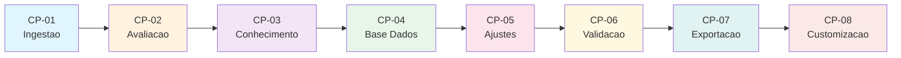

### 11.2 Tabela de Checkpoints

| ID | Nome | Processo | Criterios Obrigatorios | Dependencias |
|----|------|----------|------------------------|--------------|
| CP-01 | Ingestao Completa | P1 | Arquivo lido, nome/email extraidos | - |
| CP-02 | Avaliacao Aprovada | P2 | Score >= 60%, campos criticos OK | CP-01 |
| CP-03 | Conhecimento Gerado | P3 | x-atsData, traducoes, keywords | CP-02 |
| CP-04 | Base Gerada | P4 | JSON valido, schema OK, extensoes | CP-03 |
| CP-05 | Ajustes Aplicados | P5 | Versao incrementada, IDs integros | CP-04 |
| CP-06 | Validacao Completa | P6 | Zero erros, schema/estrutura OK | CP-05 |
| CP-07 | Exportacao Concluida | P7 | Arquivos gerados, integridade OK | CP-06 |
| CP-08 | Customizacao Concluida | P8 | CV original preservado, match score | CP-07 |

### 11.3 Fluxo de Recuperacao de Erros

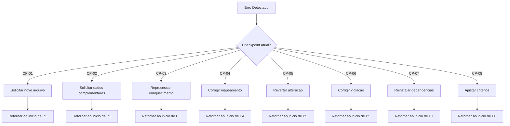

---

## Apendice A: Glossario

| Termo | Definicao |
|-------|-----------|
| ATS | Applicant Tracking System - Sistema de rastreamento de candidatos |
| i18n | Internationalization - Suporte a multiplos idiomas |
| JSON Resume | Padrao aberto para curriculos em formato JSON |
| Semver | Semantic Versioning - Versionamento semantico (MAJOR.MINOR.PATCH) |
| Schema | Definicao da estrutura e tipos de dados esperados |
| Checkpoint | Ponto de verificacao entre processos |
| Pipeline | Sequencia de processos executados em ordem |
| Parser | Componente que interpreta e extrai dados de um formato |

## Apendice B: Referencias

- [JSON Resume Schema](https://jsonresume.org/schema/)
- [JSON Schema Draft-07](https://json-schema.org/draft-07/json-schema-release-notes.html)
- [Semantic Versioning 2.0.0](https://semver.org/)
- [ISO 8601 Date Format](https://www.iso.org/iso-8601-date-and-time-format.html)
- [Mermaid Diagrams](https://mermaid.js.org/)
